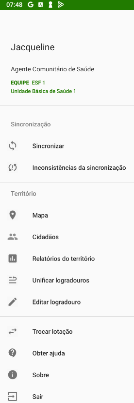
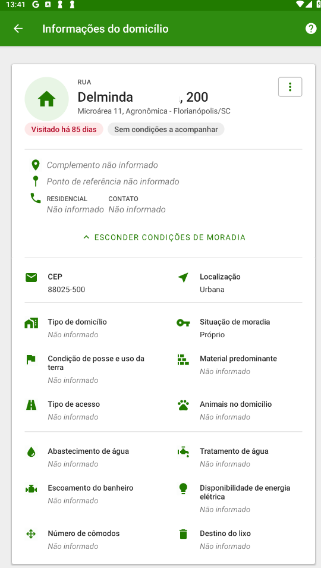
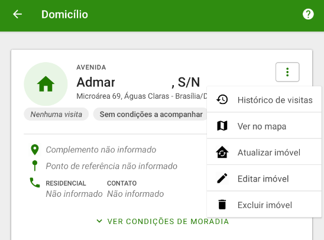
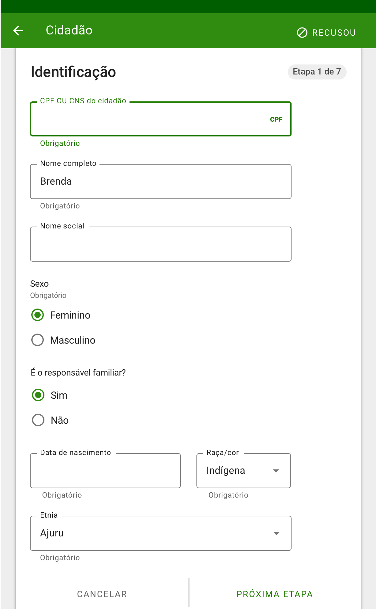
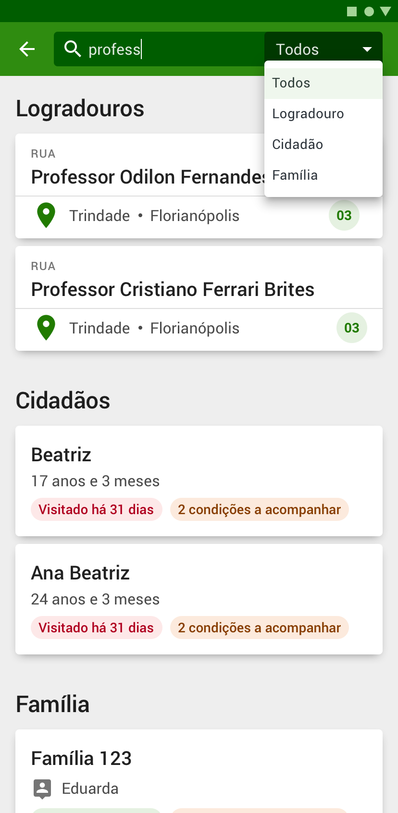

<head>
    
</head>

# Capítulo 3 - Cadastro da Atenção Básica
{: .no_toc }

## Sumário
{: .no_toc .text-delta }

- TOC
{:toc}

O cadastro da Atenção Primária à Saúde é uma extensão do Cadastro Nacional do SUS (CadSUS), complementando as informações para apoiar as equipes de Atenção Primária no mapeamento das características sociais, econômicas e de saúde da população adscrita[^1] ao território sob sua responsabilidade.

O cadastro está organizado em quatro dimensões (imóvel, territorial, familiar e individual) conforme detalhado nas seções a seguir.

{: .atencao }
O aplicativo e-SUS território a partir da versão 4.3.8 incluiu novos campos relacionados ao contexto de atendimento da saúde indígena. 

{: .dica }
A manutenção de registros de imóveis permite fazer um melhor controle pela equipe de questões de vigilância do território, bem como auxilia na inserção de novos núcleos familiares em imóveis já cadastrados.

O aplicativo permite uma visão ampliada sobre o território no qual a equipe é responsável. Inicialmente é mostrada a lista de logradouros previamente cadastrados na base de dados local do PEC após a sincronização, como mostra a imagem a seguir.

Com a sincronização dos dados do PEC ou com a evolução do cadastramento dos imóveis, se organiza uma lista de logradouros para auxiliar o TACS, o ACS, o ACE e o AAS na organização do seu processo de trabalho, conforme podemos ver na Figura 3.1.

Figura 3.1 - Lista de logradouros e imóveis, app e-SUS Território

*Fonte: SAPS/MS*

Caso a base local esteja vazia, a tela apresentada na Figura 3.1 não mostrará nenhuma informação, cabendo ao agente de saúde o início do cadastramento do território.

O ícone  situado no canto inferior direito da tela é utilizado para ofertar opções de interação de acordo com as funcionalidades disponíveis na tela.

O botão  no canto superior esquerdo mostra o menu principal do aplicativo com informações sobre o agente que está logado no aplicativo, além das opções "Sincronizar", "Inconsitências da Sicronização", "Mapa", "Cidadãos", "Relatórios de território", "Unificar Logradouros", "Editar Logradouro", "Trocar lotação", "Obter ajuda", "Sobre" e "Sair".

Figura 3.2 - Menu principal do App e-SUS Território.

*Fonte: SAPS/MS*

Ao selecionar um logradouro é possível visualizar os imóveis que estão cadastrados nesse logradouro, identificados pelo número do imóvel e o seu complemento informados no endereço.

Figura 3.3 - Lista de imóveis.

*Fonte: SAPS/MS*

Ao selecionar um imóvel é possível visualizar um resumo das suas informações de cadastro, como podemos ver na imagem abaixo. Para facilitar a identificação de situações de saúde é possível visualizar alguns marcadores que facilitam o acompanhamento do cidadão, da família e do território. Informações como ,  e  serão apresentadas para que os agentes de saúde organizem o seu trabalho no dia a dia.

Figura 3.4 - Informações do imóvel

*Fonte: SAPS/MS*

## 3.1 Cadastro de Imóvel

O Cadastro de imóvel é utilizado para registrar as características sociossanitárias dos imóveis no território das equipes de Atenção Primária. Por meio dele, é possível registrar e acompanhar a situação do territótio, assim como as condições de saúde dos cidadãos. As informações solicitadas no cadastro compõem o II Componente de vínculo e acompanhamento territorial do Novo Financiamento da Atenção Primária à Saúde. 

A dimensão cadastro é dividida em Cadastro Individual e de Cadastro Domiciliar e Territorial. Serão considerados cadastros atualizados e completos, aqueles que forem inseridos ou alterados no sistema de informação nos últimos 24 (vinte e quatro) meses. 

### 3.1.1 Novo Imóvel

Para incluir um novo imóvel é necessário selecionar o ícone  no canto inferior direito da tela lista de logradouros, caso o logradouro já esteja cadastrado.

{: .nota }
Para mais informações sobre os conceitos que dizem respeito ao cadastramento dos imóveis recomenda-se a leitura do Manual do Sistema com Coleta de Dados Simplificada (CDS).

O cadastro de imóveis é dividido em quatro etapas para os seguintes tipos de imóveis: Domicílio, Abrigo, Instituição de Longa Permanência, Unidade Prisional, Unidade de Medida Sócio Educativa e Delegacia. Já os imóveis com duas etapas para cadastro são: Estalelecimento Religioso, Terreno Baldio, Ponto Estratégico, Escola, Creche, Comércio, Casai e Outros.  

-   Primeira etapa: dados do endereço.

Figura 3.5 - Tela Cadastro de imóvel com quatro etapas

Fonte: SAPS/MS.

{: .dica Inclusão do tipo de imóvel CASAI - Casa de Saúde Indígena}  

-   Segunda etapa: dados de condições de moradia (parte 1).

Figura 3.6 - Tela Edição de imóvel

Fonte: SAPS/MS.

{: .atualização } 
Em caso de cadastro em área rural, foram incluídas no campo condição de posse duas opções: ""Terra indígena demarcada" e 
"Terra não demarcada"

No campo tipo de domicílio foram incluídas mais duas opções: "Maloca" e "Improvisado". 

-   Terceira etapa: condições de moradia (parte 2).

{: .atualização }
No campo Material predominante na construção das paredes externas de seu domicílio foram incluídas as seguintes opções:  "Lona", "Misto/Diferentes materiais", "Caule de palmeira" e "Sem parede". 

No campo abastecimento de água foram atualizadas e incluídas as seguintes opções: "Ponto de abastecimento coletivo - chafariz", "Rede encanada até o domicílio - Sistema de abastecimento próprio da aldeia (SESAI)", "Captação direta de água do rio", "Captação direta de poço coletivo".  

No campo Água para consumo no domicílio foram incluídas as seguintes opções: "Clorada intradomiciliar com hipoclorito de sódio", a opção Filtrada foi dividida em duas: "Filtrada com filtro de barro" e "Filtrada por outro tipo de filtro". 

No campo Disponibilidade de energia elétrica? se a resposta for sim, habilita as seguintes opções: Concessionária,Gerador comunitário, Gerador individual, Fotovoltaica comunitária e Fotovoltaica individual. 

No campo Animais no domicílio? - Qual(is)? foram incluídos os seguintes animais: "Macaco", "Galinha", "Porco" e "Répteis"

Figura 3.7 - Tela Cadastro de imóvel (Condição de moradia)

Fonte: SAPS/MS.

-    Quarta etapa: Informar a posição do imóvel no Mapa.

Para poder utilizar os recursos do Mapa, o agente de saúde precisa autorizar o acesso ao serviço de localização do seu smartphone ou tablet. 

{: .nota }
O aplicativo somente apontará a sua localização quando o agente de saúde, de forma voluntária, registrar uma visita ou atribuir uma posição no mapa para os imóveis. 

Posicione o ícone até a localização aproximada onde o imóvel se encontra, para que isso aconteça arraste o mapa na tela. 

Figura 3.8 - Tela Posição no Mapa

Fonte: SAPS/MS

Para visualizar todos os imóveis informados no Mapa acesse o Menu Principal do Aplicativo  e clique em Mapa (Figura 3.2).

-   Ao finalizar o cadastro, é apresentada a tela com as informações do imóvel cadastrado. Para visualizar ou esconder os dados do imóvel clique em "ver condições de moradia" ou "esconder condições de moradia".

Figura 3.09 - Tela Informações do domicílio

*Fonte: SAPS/MS*

### 3.1.2 Recusa do Cadastro de Imóvel

Nas primeiras duas etapas do cadastro do imóvel é possível informar a recusa (Adicionar Recusa) de cadastro através do botão  no canto superior direito da tela. É importante esclarecer para o cidadão que apesar da recusa em cadastrar o imóvel não haverá impendimento para acesso à unidade básica de saúde. 

Figura 3.10 - Tela de cadastro de imóvel

*Fonte: SAPS/MS*

Para informar a recusa do cadastro do imóvel ainda será necessário preencher todos os campos obrigatórios de identificação do mesmo.

{: .nota }
a opção de recusa do cadastro só está disponível para os tipos de imóveis: Domicílio, Abrigo, Instituição de Longa Permanência para Idosos, Unidade Prisional, Unidade de Medida Sócio Educativa e Delegacia.

### 3.1.3 Atualizar Cadastro de Imóvel

Ao acessar um imóvel cadastrado, clique no ícone  para atualizar as informações do imóvel.

Figura 3.11 - Tela Informações do domicílio

*Fonte: SAPS/MS*

Para atualizar o cadastro clique em "Atualizar imóvel", e em seguida basta seguir os mesmo passos citados na Seção 3.1.1.

## 3.2 Cadastro da Família

Diferente das fichas de Coleta de Dados Simplificada, que cria os núcleos familiares através da vinculação de responsável familiar e dependentes automaticamente, o aplicativo e-SUS Território dispõe do cadastro da família para realizar as vinculações entre as pessoas que compõem este núcleo familiar de forma mais detalhada. A aplicação móvel tem ampla vantagem nesta funcionalidade em relação às fichas de papel.

Ao finalizar o cadastro de imóvel, clique em "Adicionar Família" para iniciar o registro de uma família.

Em seguida preencha as informações sobre a família: Número do prontuário familiar, renda familiar, número de membros e reside desde (mês/ano).

Figura 3.11 - Adicionar Família

*Fonte: SAPS/MS*

### 3.2.1 Nova Família

Ao clicar em  abrirá uma tela para cadastrar uma "Nova Família". 

Em seguida preencha as informações da família;

Figura 3.13 - Tela Nova família

*Fonte: SAPS/MS*

Clique em Cadastrar  para finalizar o cadastro;

Figura 3.14 - Nova família cadastrada

*Fonte: SAPS/MS*

### 3.2.2 Editar Família

Para editar os dados de um núcleo familiar, siga os passos:

-   selecionando o ícone  na família, aparecerá os recursos
    editar família, família mudou e informações;

Figura 3.15 - Tela Informações do domicílio

*Fonte: SAPS/MS*

-   clique na opção "Editar família" . Será apresentada uma tela igual à de cadastro da família. Altere os dados desejados e clique em "Atualizar" para finalizar a edição;

Figura 3.16 - Tela Editando família

*Fonte: SAPS/MS*

### 3.2.3 Desvincular Família do imóvel

Para desvincular a família de um imóvel, orientado ao que ocorre na prática no território, é utilizada a opção "Família mudou"  para informar que a família não reside mais no domicílio em questão.

Para editar os dados de um núcleo familiar, selecione o ícone  na família e clique em "Familia mudou";

## 3.3 Cadastro de Cidadão

Após a criação do núcleo familiar passamos para o cadastro dos indivíduos que fazem parte desta família. O Cadastro Individual é utilizado para registrar as características sociodemográficas, problemas e condições de saúde dos cidadãos. Tem como objetivo captar informações sobre os cidadãos que se encontram adscritos no território das equipes de Atenção Primária. O cadastramento e sua atualização periódica são uma das atribuições dos Técnico em Agente Comunitário de Saúde (TACS) e Agente Comunitário de Saúde (ACS) nas equipes da Estratégia Saúde da Família (ESF). Para as demais equipes de APS, este fluxo será definido em cada localidade.

{: .nota }
Para mais informações sobre os conceitos que dizem respeito ao cadastramento dos domicílios recomenda-se a leitura do Manual do Sistema com Coleta de Dados Simplificada (CDS).

### 3.3.1 Novo Cidadão

Para adicionar um cidadão em um núcleo familiar clique em .

Figura 3.17 - Tela Informações do domicílio

*Fonte: SAPS/MS*

Em seguida será exibido o cadastro do cidadão. O cadastro está dividido em sete etapas, que são detalhadas a seguir:

-   Primeira etapa: Identificação do cidadão (parte 1)

Figura 3.18 - Tela Cadastro de cidadão

*Fonte: SAS/MS*

Nesta etapa é possível informar, entre outras variáveis, se o cidadão que está sendo cadastrado é o responsável familiar, entretanto, é obrigatório o registro do CPF ou CNS do cidadão. 

Caso o responsável familiar tenha se mudado , ido a óbito  ou simplesmente excluído o responsável familiar, uma caixa de diálogo será aberta para a indicação do novo responsável. No capítulo 3.4 será abordado como se registra uma saída do cadastro.

Figura 3.19 - Tela Informar novo responsável

*Fonte: SAPS/MS*

-   Segunda etapa: Identificação do cidadão (parte 2).

Figura 3.20 - Tela Cadastrar cidadão

*Fonte: SAPS/MS*

-   Terceira e quarta etapa Informações sociodemográficas.

Figura 3.21 - Tela Cadastrar cidadão

*Fonte: SAPS/MS*

{:.atencao}
Na quarta etapa, os profissionais devem obrigatoriamente solicitar do cidadão informações para os campos orientação sexual e identidade de gênero.

Figura 3.22 - Tela Cadastrar cidadão

*Fonte: SAPS/MS*

-   Quinta e sexta etapa: Condições/situações de saúde, selecione a resposta (Sim ou Não) às questões conforme a pergunta indicada no quadro;

Figura 3.23 - Tela Cadastrar cidadão

Fonte: SAPS/MS.

- Sétima etapa: Informações sócioeconômicas, selecione a respota (sim ou não) às questões conforme a pergunta indicada no quadro.

Figura 3.24 - Tela Cadastrar cidadão

Fonte: SAPS/MS.

-   Clique em FINALIZAR CADASTRO para finalizar e salvar o cadastro do cidadão.

{: .nota }
Caso tenha sido cadastrado em situação de rua, será exibida uma oitava etapa com questões pertinentes à tal situação.

### 3.3.2 Recusa do Cadastro de Cidadão

Nas primeiras duas etapas do cadastro de cidadão é possível informar a recusa (Adicionar Recusa) de cadastro através do botão  no canto superior direito da tela. Mesmo com a recusa do cidadão, sugere-se a coletada de alguns dados (não obrigatórios) como: CPF ou CNS do cidadão; Nome completo e/ou Nome social; Data de nascimento; sexo; Raça/cor; Nacionalidade; Telefone celular; e-mail; Nome completo da mãe e nome completo do pai. A partir dessa informação, gera o registro de recusa do cidadão. No entanto, é importante esclarecer que mesmo com a recusa do cadastro não haverá impedimento para atendimento à unidade básica de saúde. 

Figura 3.25 - Tela de Cadastro de cidadão

*Fonte: SAPS/MS*

### 3.3.3 Atualizar o Cadastro do Cidadão

Após cadastrar o cidadão, é possível visualizar se é necessário atualizar os dados do cadastro de cidadão.

1.  Em "Logradouro" busque o imóvel cadastrado e a família e depois clique sobre o nome do CIDADÃO.

Figura 3.26 - Tela Informações do domicílio

*Fonte: SAPS/MS*

2.  Clique em  em seguida "Atualizar Cidadão". Confira os dados de identificação. É possível visualizar alguns marcadores que facilitam o acompanhamento do cidadão. Informações como há quanto tempo o cidadão não recebe uma visita e as condições a serem acompanhadas serão apresentadas como marcadores , , , logo abaixo do nome do cidadão;

Figura 3.27 - Tela Informações do cidadão

*Fonte: SAPS/MS.*

3.  Verifique as "Informações Sociodemográficas" e as "Condições de saúde";

4.  Caso encontre alguma informação desatualizada clique em "Finalizar".

## 3.4 Saída do Território / Cadastro

Para retirar um cidadão do cadastro, ou seja, da rotina de acompanhamento, é necessário informar o motivo da saída do cadastro. A seguir são apresentadas as opções de saída do território.

### 3.4.1 Registro de Mudança

É possível registrar dois tipos de mudança de imóvel, mudança de um cidadão individualmente ou mudança de uma família. Essas ações correspondem à uma atualização de fichas de Cadastro Individual, com opção de Saída do território, motivo Mudança de território e Cadastro de imóvel, com a opção "mudou-se" marcada na referida família, respectivamente. Para alterar a residência do cidadão para outro imóvel dentro do próprio território da eSF basta cadastrá lo no novo imóvel/família, informando o CPF ou CNS do mesmo. Caso toda uma família tenha se mudado para outro imóvel no mesmo território da eSF basta cadastrar o responsável dela no novo imóvel/família, informando o CPF ou CNS do responsável familiar. Assim, após realizar a sincronização todos os membros da família serão automaticamente transferidos junto com o responsável.

#### 3.4.1.1 Mudança do Cidadão

É possível registrar a mudança de um cidadão através da opção "Cidadão mudou" :

1.  No menu de contexto de um cidadão , clique na opção ;

Figura 3.30 - Tela Informações do domicílio

*Fonte: SAS/MS.*

2.  o sistema registra a informação e apresenta a mensagem "Cidadão mudou-se".

Figura 3.31 - Tela com nome do cidadão

*Fonte: SAPS/MS*

#### 3.4.1.2 Mudança da Família

Também é possível registrar a mudança de uma família através do botão .

1.  No menu de contexto de uma família , clique na opção ;

Figura 3.32 - Tela de contexto da família

*Fonte: SAS/MS*

2.  O sistema registra a informação no sistema e apresenta a mensagem "Família mudou-se". Na frente da identificação da família será apresentada a marcação "Mudou-se" .

Figura 3.33 - Tela de contexto da família

*Fonte: SAPS/MS*

### 3.4.2 Registro de Óbito

É possível registrar o óbito de um cidadão através da opção  dentro do menu de contexto de um cidadão .

1.  No menu de contexto de um cidadão, clique na opção ;

Figura 3.34 - Tela de informações do domicílio

*Fonte: SAPS/MS*

2.  Preencha os dados sobre o óbito;

Figura 3.35 - Tela Informar óbito

*Fonte: SAPS/MS*

3.  Clique em "Informar Óbito"  para finalizar;

4.  Abaixo do nome do cidadão será apresentada a marcação "Óbito".

Figura 3.36 - Tela com nome do cidadão

*Fonte: SAPS/MS*

### 3.4.3 Desfazer

Após o registro de óbito ou registro de mudança, se não houver sincronizado o aplicativo, é possível desfazer o registro na opção de abertura do menu de contexto.

Figura 3.37 - Tela contexto da família

*Fonte: SAPS/MS*

Ao selecionar o ícone  na família são apresentadas algumas opções de gerenciamento. No ícone  é possível editar as informações do núcleo familiar.

Conceituando algumas opções disponíveis no menu "Família", temos:

-   : Abre a tela de edição da família.

-   : Permite informar mudança de domicílio da família.

-   : Opção disponível enquanto não houver sincronização do registro recém criado.

Ao selecionar o ícone  no cidadão são apresentadas algumas opções de gerenciamento do cadastro.

Figura 3.39 - Menu principal do App e-SUS Território.

*Fonte: SAPS/MS*

Conceituando algumas opções disponíveis no menu "Cidadão", temos:

-   : Disponível para edição apenas dos dados que ainda não foram sincronizados.

-   : Abre a tela de atualização do cadastro do cidadão.

-   : Permite informar a mudança de domicílio do cidadão.

-   : Permite informar o óbito do cidadão.

-   : Exclusão do cadastro realizado que ainda não foi sincronizado.

## 3.5 Cadastrar Logradouro

Quando não existe nenhum logradouro previamente cadastrado no aplicativo e-SUS Território é possível adicionar novos logradouros clicando no botão  (Figura 3.40).

Figura 3.40 - Cadastrar Logradouro

*Fonte: SAPS/MS*

Em seguida serão abertas as telas de cadastro de imóvel compostas pelas 03 (três) etapas conforme descrito no capítulo 3.1.1 Novo Domicílio. Ao finalizar as etapas aparecerá a tela com as informações do imóvel e logradouro cadastrado (Figura 3.12).

### 3.5.1. Editar Logradouro

Esta funcionalidade está disponível com a finalidade de reeditar um logradouro previamente cadastrado e está acessível por meio do menu na barra do aplicativo. Ao clicar no botão  e em seguida em "Editar logradouro" será aberta uma tela com um combo para selecionar um logradouro previamente cadastrado na qual se quer reeditar. A partir dessa seleção é possível selecionar o logradouro para editar, alterar o nome do logradouro, tipo de logradouro, bairro e município. Após realizar as alterações desejadas basta clicar em "Concluir" (Figura 3.13).

Figura 3.42. Editar Logradouro

*Fonte: SAPS/MS*

### 3.5.2. Unificar Logradouro

Esta funcionalidade (disponível a partir da versão 1.4 do aplicativo e compatível com versões a partir da v3.2 do e-SUS APS com PEC) tem como objetivo a unificação dos logradouros previamente cadastrados no aplicativo e-SUS Território e que estão duplicados. Por meio do menu na barra do aplicativo clique no botão  e em seguida "Unificar logradouro". Após aparecerá uma tela para unificar os logradouros com os combo box "Logradouro de origem" e "Logradouro de destino" (Figura 3.43). Sendo que "Origem" é o logradouro que será movido para o logradouro "Destino". Por tanto, ao unificar os logradouros será mantido o de "Destino".

Figura 3.43. Unificar Logradouros

*Fonte: SAPS/MS*

Ao clicar nos combos "Logradouro de origem" e/ou "Logradouro de destino" serão exibidos todos os logradouros da base do aplicativo e-SUS Território com as informações do tipo de logradouro, nome do logradouro e bairro (Figura 3.44).

Figura 3.44. Logradouros

*Fonte: SAPS/MS*

Ao selecionar os logradouros de "Origem" e de "Destino" clique no botão "Confirmar" e será aberta uma nova tela com a informação de que "Todos os imóveis do logradouro de Origem serão atualizados com as informações do logradouro de Destino". Se tiver certeza que deseja unificar os logradouros clique em "Confirmar" novamente (Figura 3.45).

Figura 3.45. Mesclar Logradouros

*Fonte: SAPS/MS*

{: .atencao }
Se o Logradouro possuir domicílios com cadastros incompletos não será possível selecioná-lo como logradouro de "Origem". Ademais o logradouro de origem não poderá ser igual ao de "Destino".

{: .nota }
Se um domicílio possuir uma nova atualização de cadastro na mesma data que se quer unificar os logradouros, o imóvel deverá ser editado e não atualizado. Imóveis atualizados ao unificar logradouros não são contabilizados nos relatórios de produção.

## 3.6. Buscar logradouro, família ou cidadão

Na barra superior da tela de listagem de logradouros cadastrados existe uma ferramenta de busca na qual é possível localizar o cidadão, a família ou o logradouro. A busca pode ser feita por meio do nome, nome social, CNS ou CPF, no caso dos cidadãos. Para famílias, é possível realizar a busca por nome do responsável ou número do prontuário familiar. Para a busca de logradouro buscar pelo nome do logradouro. Pode-se também realizar uma única busca em todas as três categorias, selecionando a opção "Todos".

Figura 3.46. Tela de busca do cidadão ou logradouro

Fonte: SAPS/MS.

## 3.7 Filtros

Também na barra superior do aplicativo é possível acessar a funcionalidade de Filtros, que permitirá listar somente os logradouros e imóveis cadastrados cujas informações sejam compatíveis aos critérios filtrados, sejam elas dos próprios cadastros domiciliares ou de seus respectivos moradores.

Figura 3.47. Tela de filtros

*Fonte: SAPS/MS*

Havendo filtros aplicados, os mesmos serão exibidos no topo das listas de Logradouros e Imóveis na forma de etiquetas, tal como mostrado na imagem. Tais filtros podem ser removidos diretamente por estas etiquetas ou pela opção "LIMPAR".

Figura 3.48. Indicação de filtros aplicados

*Fonte: SAPS/MS*

[^1]: Segundo a Política Nacional de Atenção Básica (BRASIL, 2011), "adscrição de usuários" é um processo de vinculação de pessoas e/ou famílias e grupos a profissionais/equipes, com o objetivo de ser referência para o seu cuidado.