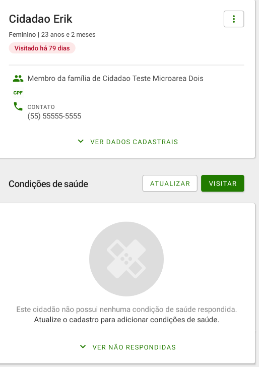
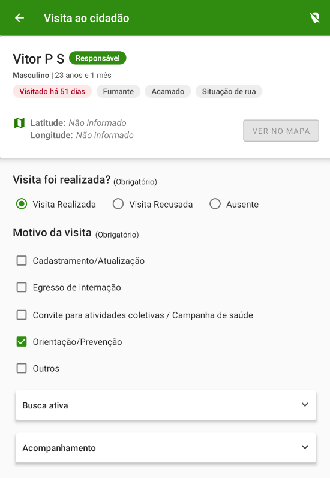
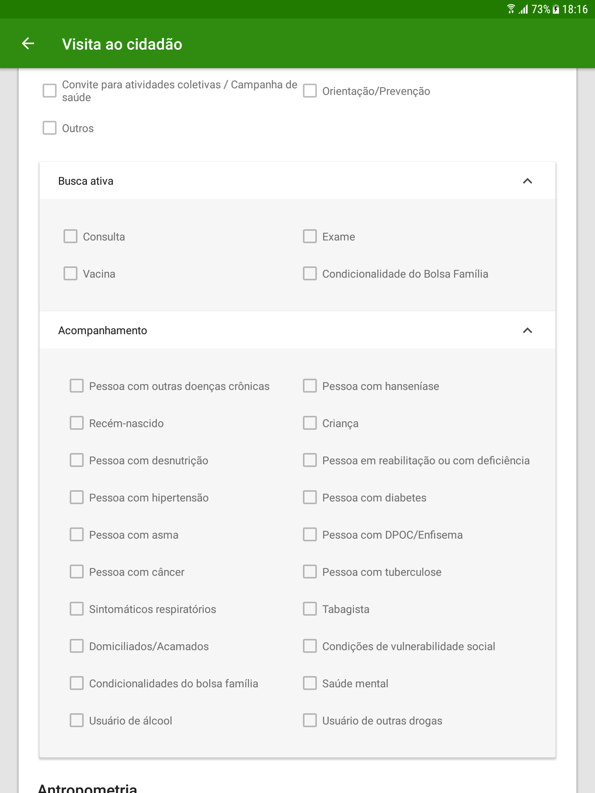
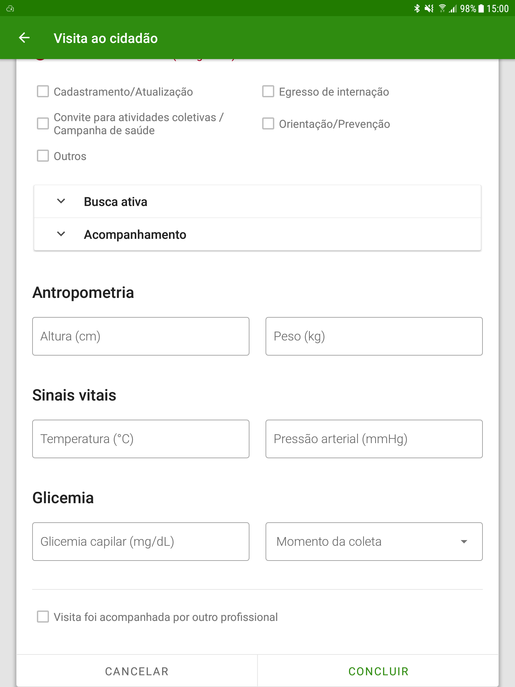
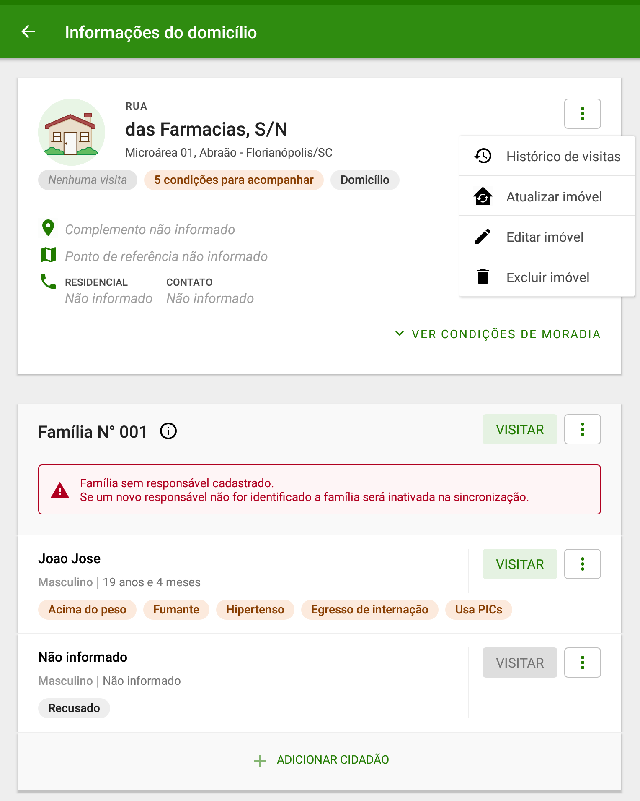
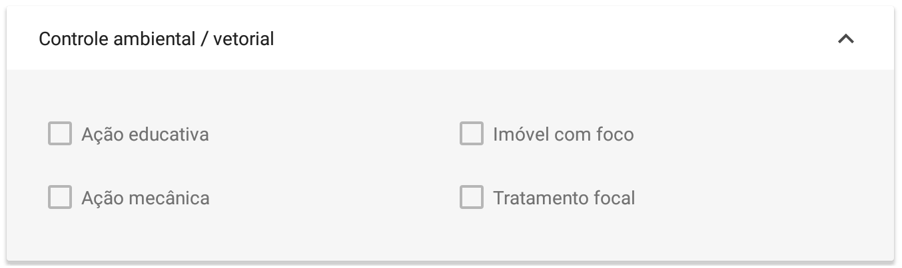
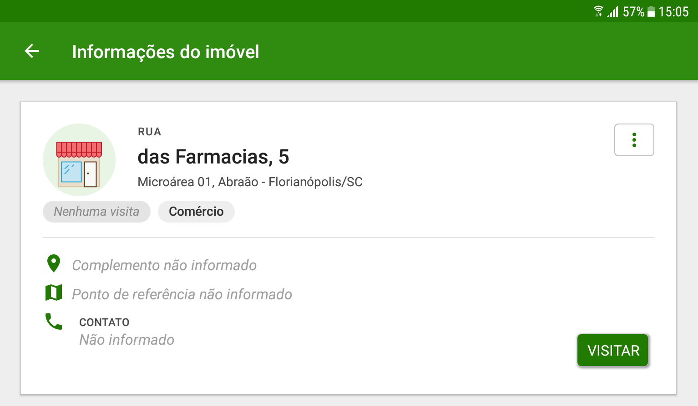
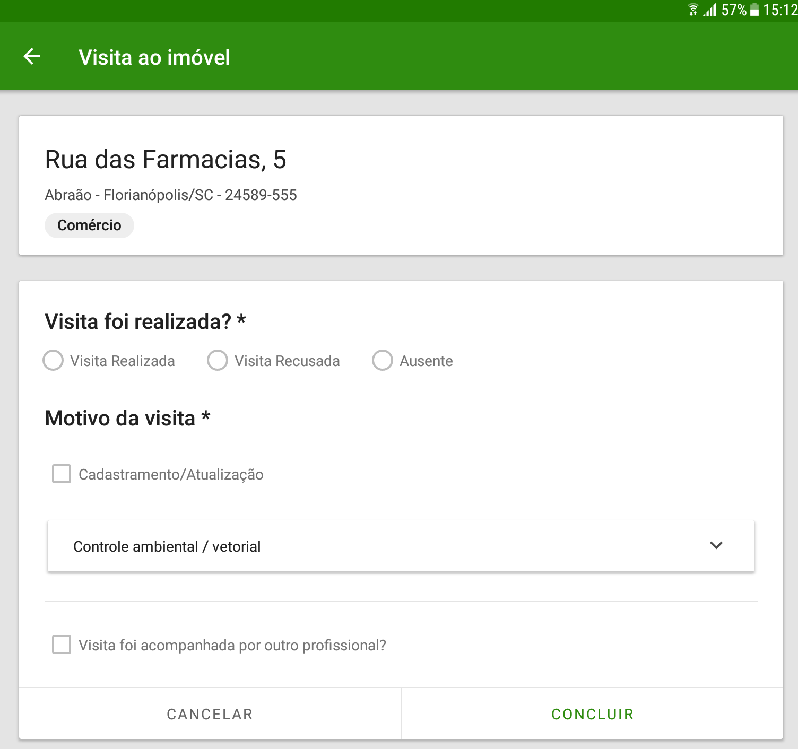
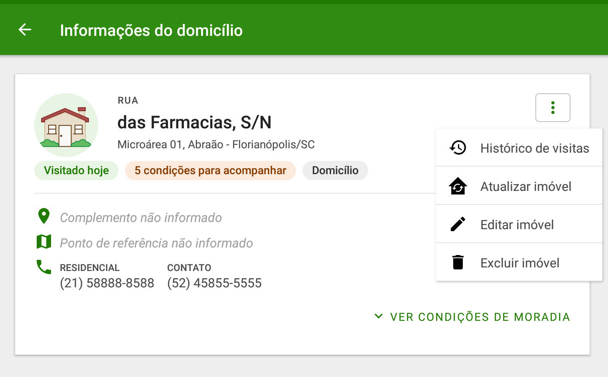
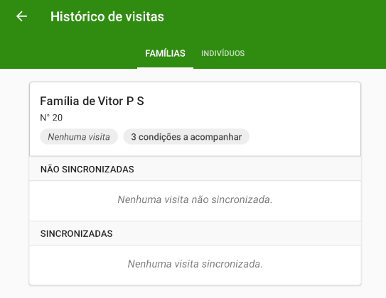

# Capítulo 4 - Visita Domiciliar e Territorial
{: .no_toc }

## Sumário
{: .no_toc .text-delta }

- TOC
{:toc}

Após cadastrar os domicílios, os núcleos familiares e os cidadãos que compõem os núcleos familiares é possível registrar as visitas domiciliares e territoriais, tanto individualmente a depender das condições específicas de cada cidadão, quanto em contexto de acompanhamento periódico das famílias, conforme visto na Figura 4.1.

## 4.1 Visitar Cidadão

A visita ao cidadão tem foco nas necessidades específicas de acompanhamento do cidadão no contexto familiar e vinculado a um domicílio dentro do território adstrito à equipe de saúde.

Siga os passos para registrar a visita:

1.  Clique na opção  no cidadão que está sendo visitado;

Figura 4.1 - Tela com nome do cidadão

*Fonte: SAPS/MS*

{: .atualizacao }
A partir da versão 3.1, é possível visualizar as condições de saúde do cidadão, ao acessar o perfil para registrar a visita domiciliar.

2.  Em seguida a tela de registro da visita será exibida. Nesta tela será registrada a "Visita foi realizada", o "Motivo da visita", "Busca ativa" e/ou "Acompanhamento".

Figura 4.2 - Tela Visita ao cidadão

*Fonte: SAPS/MS*

3.  No bloco "Busca ativa" e "Acompanhamento" clique na seta  para abrir os campos a serem preenchidos em motivo da busca ativa e qual tipo de acompanhamento o agente está realizando. Após preencher todas as informações necessárias da Visita ao cidadão clique em "Concluir".

Figura 4.3 - Tela visita ao cidadão

*Fonte: SAPS/MS*

{: .atualizacao }
A partir da versão 3.2, além da possibilidade de registrar a antropometria e se a "visita foi acompanhada por outro profissional", também é possível registrar os sinais vitais (temperatura e pressão arterial), assim como o momento da coleta da glicemia capilar.

Figura 4.4 - Tela visita ao cidadão

*Fonte: SAPS/MS*

{: .nota }
O registro dos campos sinais vitais (temperatura e pressão arterial) e glicemia pelos ACS está de acordo com a Lei nº 13.595, de 05 de Janeiro de 2018, que incluiu novas atribuições aos Agentes Comunitários de Saúde. Esta normativa refere que o ACS somente realizará a aferição dos sinais vitais e da glicemia capilar, a partir do momento que tenha concluído o curso técnico e tenha disponíveis os equipamentos adequados, além de ser assistido por profissional de saúde de nível superior e que seja membro da equipe. 

## 4.2 Visitar Família

Quando não houver um motivo de busca ativa ou acompanhamento, a visita familiar é destinada a abordagem familiar, caracterizando-se como "Visita Periódica" que também faz parte da rotina dos agentes.

{: .nota }
Para que o sistema habilite a opção de "Visitar" família, é necessário existir o cadastro de um **responsável familiar** no núcleo familiar.

Siga os passos para registrar a visita a família:

1.  Clique na opção  a família;

Após clicar em visitar abrirá a opção de registrar se a "Visita foi realizada?", o "Motivo da visita", se foi para controle ambiental/vetorial e se a "visita foi acompanhada por outro profissional".

2.  Se for uma visita à família para controle ambiental/vetorial clique na seta  para abrir as opções de registro.

3.  Clique em "Finalizar" para concluir a visita.

## 4.3 Visitar imóvel

O Agente de saúde pode registrar uma visita realizada a um imóvel que não seja um domicílio.

Siga os passos para registrar uma visita ao imóvel:

1.  Clique na opção "Visitar" o imóvel

Figura 4.5 - Tela Informações do imóvel

*Fonte: SAPS/MS*

2.  Em seguida preencha as informações que foram colhidas na visita sobre se a "Visita foi realizada?", o "Motivo da visita", se houve alguma ação de "Controle ambiental/vetorial" e se a "visita foi acompanhada por outro profissional".

Figura 4.6 - Tela Visita ao imóvel

*Fonte: SAPS/MS*

3.  Se for uma visita ao imóvel para controle ambiental/vetorial clique na seta  para abrir as opções de registro.

4.  Ao finalizar a visita clique em "FINALIZAR".

## 4.4 Histórico de Visitas

No menu de informações do domicílio existe a opção "Histórico de Visitas", que permite a consulta das visitas realizadas a família.

Figura 4.7 - Menu principal do App e-SUS Território.

*Fonte: SApS/MS*

Ao selecionar a opção "Histórico de visitas" será aberta a lista de todas as visitas realizadas a qualquer membro da família correspondente ou à família desde a última sincronização.

Figura 4.8 - Menu principal do App e-SUS Território.

*Fonte: SAPS/MS*

Esta tela permite ainda a seleção de visitas para exclusão ou edição enquanto ainda não houve a sincronização dos dados.