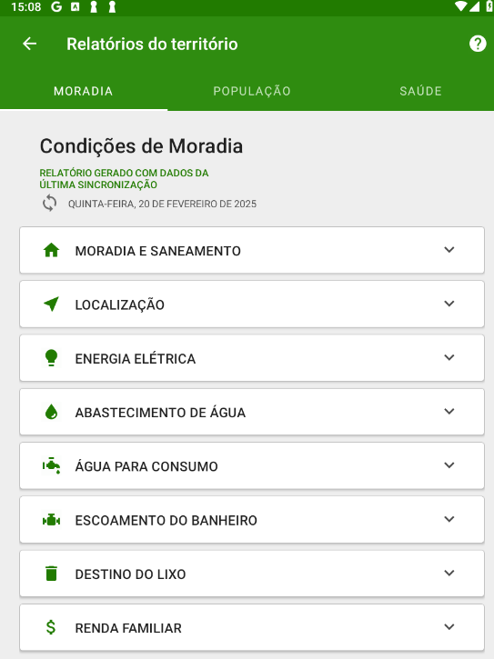

<head>
    
</head>

# Capítulo 5 - Relatórios
{: .no_toc }

## Sumário
{: .no_toc .text-delta }

- TOC
{:toc}

A partir das novas versões do e-SUS Território, foram incluídos alguns relatórios que permitem uma visão consolidada de ações registradas utilizando o aplicativo.

Para abrir os relatórios clique no menu de contexto do usuário e acesse o ícone "Relatórios do Território" .

Figura 5.1 - Tela de Menu de Contexto do Usuário.

*Fonte: SAPS/MS*

O aplicativo oferece três tipos de relatórios, conforme descrito nas próximas seções.

## 5.1 Condições de Moradia

O relatório de condições de moradia busca consolidar os registros provenientes dos cadastros domiciliares.

Figura 5.2 - Relatórios do território da equipe: Condições de moradia

*Fonte: SAPS/MS*

## 5.2 População

O relatório traz informações distribuição de faixas etárias dos cidadãos do território. É um relatório tradicional que ajuda a visualizar a distribuição da população relacionada ao cadastro individual do território.

Figura 5.3 - Relatórios do território da equipe: População

*Fonte: SAPS/MS*

## 5.3 Situação de Saúde

O relatório de situação de saúde, tem o objetivo de consolidar a situação de saúde do território, com base nos dados coletados na ficha de cadastro individual sobre a situação e condição de saúde do cidadãos adscritos.

Figura 5.4 - Relatório do território da equipe: Situação de saúde

*Fonte: SAPS/MS*
