<head>
    
</head>

### Versão 5.1

## Módulos com novidades:

* Marcadores de consumo alimentar  
* Busca ativa de vacinação  
* Encaminhamento externo  
* Adaptação do PEC para uso do estagiário  
* Reterritorialização

* Agora é possível registrar o marcador de consumo alimentar do cidadão diretamente no atendimento. A opção foi incluída no Objetivo do SOAP em quase todos os tipos de atendimento e o formulário é apresentado de acordo com a idade do cidadão.

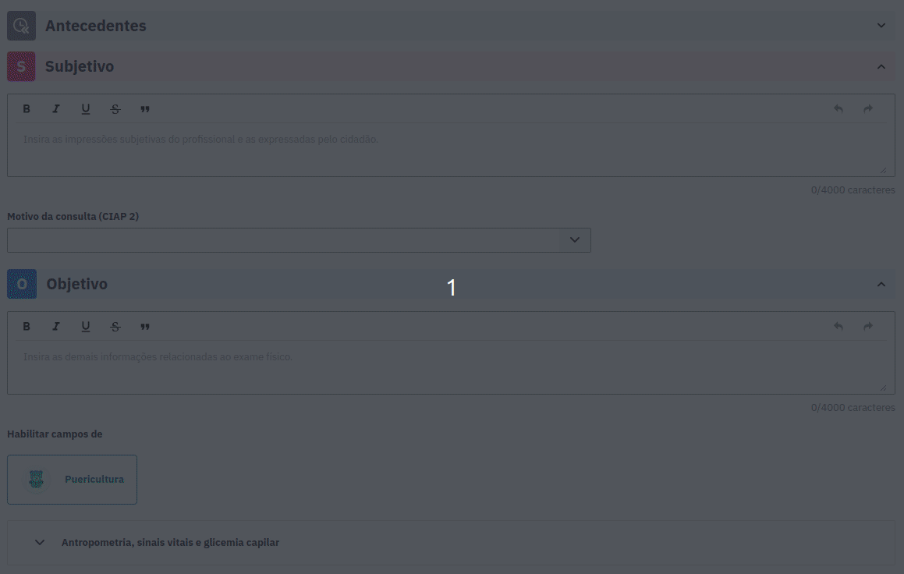

* As informações de consumo alimentar registradas no atendimento também são apresentadas no histórico e impressão. É possível reconhecer um atendimento com esse registro através da etiqueta “Marcadores de consumo alimentar".

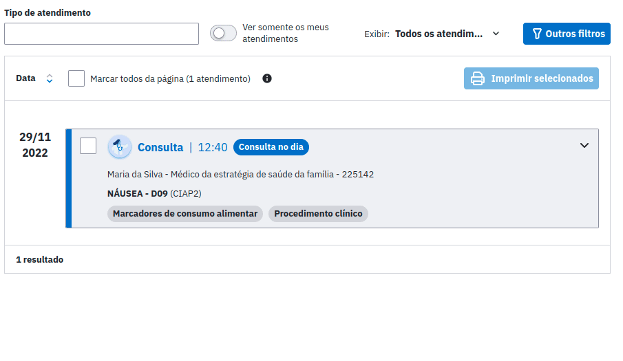

* A funcionalidade permite realizar a **Busca ativa de vacinação** retornando uma listagem com os dados dos cidadãos que possuem doses de imunobiológicos **Atrasadas** ou **No prazo** para serem aplicadas, considerando as vacinas do calendário vacinal e as doses das vacinas de **Covid-19** com status de **Aplicadas** nos cidadãos. O profissional poderá também realizar a exportação do relatório da busca em formato **CSV** para manipulação dos dados.

* O resultado na listagem é filtrado a partir dos seguintes campos:

* **Grupo-alvo:** deve filtrar os cidadãos pelos grupos-alvos do calendário vacinal ou que estejam na faixa etária selecionada para as vacinas de Covid-19;

* **Status da vacina:** para as vacinas do calendário vacinal, é possível filtrar os imunobiológicos e suas respectivas doses a partir dos status Atrasada (vacinas não tomadas dentro do calendário vacinal) ou No prazo (vacinas não tomadas do calendário vacinal que estão dentro do prazo para aplicação). Para as vacinas da Covid-19, é possível filtrar os imunobiológicos e suas respectivas doses pelo status Aplicada.

* **Imunobiológico:** a busca é filtrada pelos cidadãos que contém as vacinas Atrasadas e No prazo (para vacinas do calendário vacinal) ou Aplicadas (para vacinas de Covid-19) do(s) imunobiológico(s) selecionado(s) no campo.

* **Dose:** a busca é filtrada pelos cidadãos que contém as vacinas com a(s) dose(s) selecionada(s) no campo.

* Estão disponíveis para seleção os grupos alvo de **"Crianças (0 a 9 anos)"** e **"Adolescentes (10 a 19 anos)".**

* Para gerar a listagem com os filtros selecionados, basta clicar no botão **"Buscar cidadãos"**, que deve ser exibida com as seguintes colunas: **Cidadão, Idade, Endereço, e Status da vacina (Atrasada ou No prazo para o Calendário vacinal e Aplicada para as vacinas de Covid-19).**

* A listagem pode ainda ser **ordenada** pelas colunas: Cidadão, Idade.

**Imagem 1:**

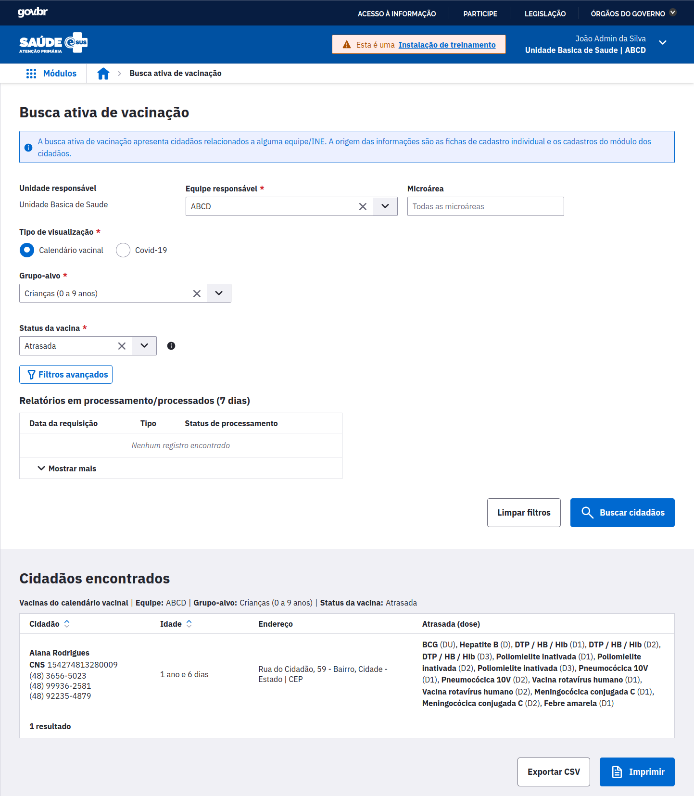

**Imagem 2:**

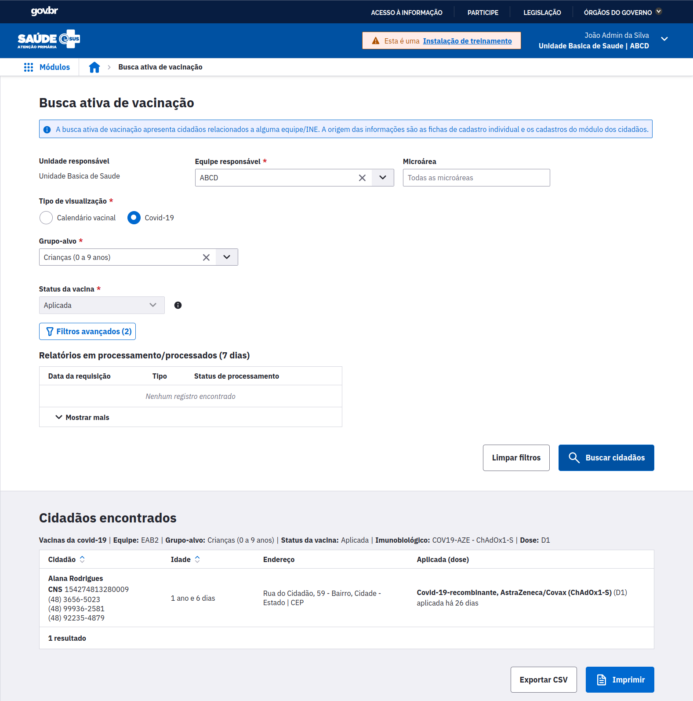

**Imagem 3:**

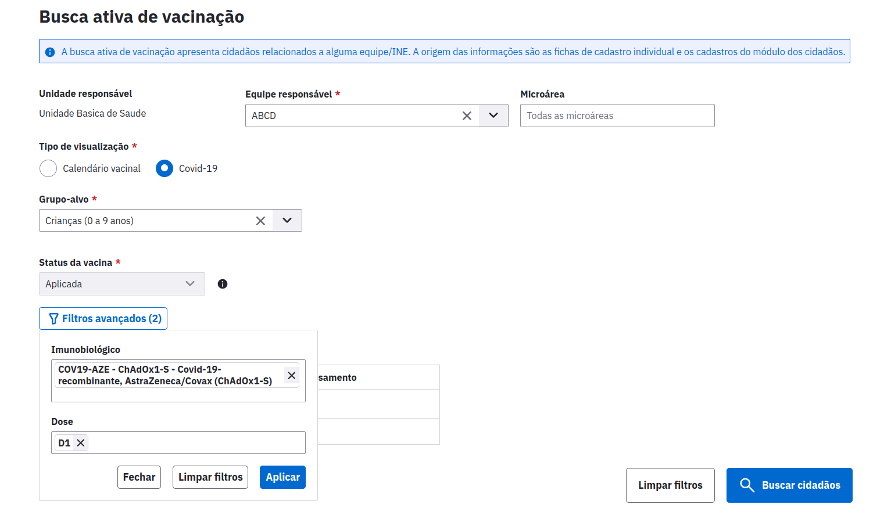

Agora é possível registrar novos tipos de encaminhamento externo na seção de Plano dos atendimentos. Foram incluídas as opções:

* CAPS;
* Urgência;
* Internação hospitalar;
* Serviço de Atenção Domiciliar;
* Intersetorial.

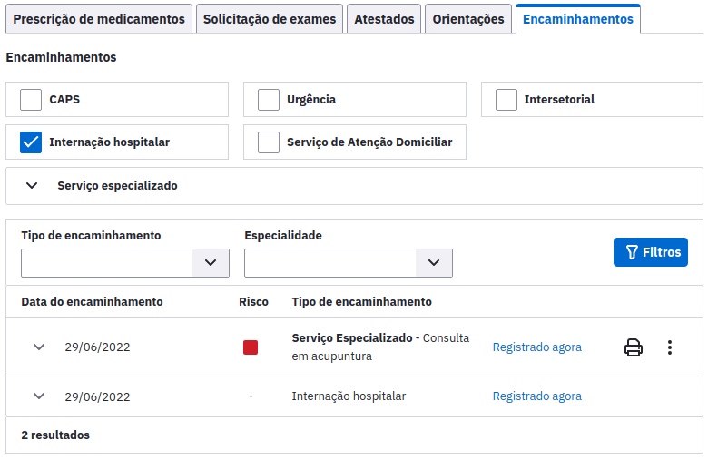

A nova funcionalidade permite que estagiários utilizem o PEC e tenham os atendimentos validados pelo supervisor antes da finalização. Foram inseridos os seguintes fluxos no sistema para adaptá-lo ao uso do estagiário:

* Login individual para o estagiário;
* Cadastro de uma lotação de estágio com um respectivo supervisor;

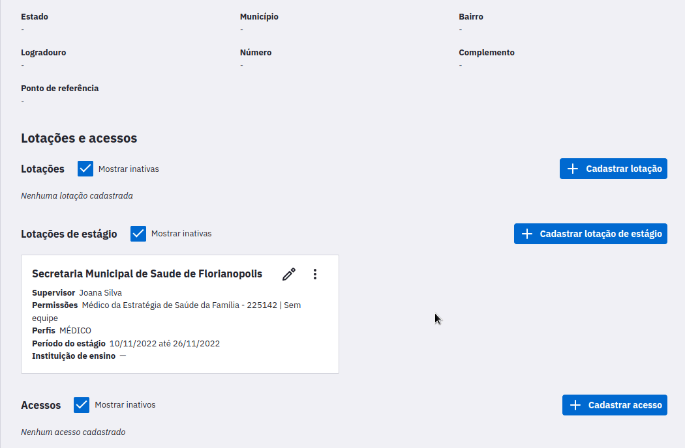

* Retificação dos atendimentos realizados pelo estagiário antes do início da revisão pelo supervisor;
* Revisão dos atendimentos feitos pelo estagiário antes da finalização;

Atualizações no Histórico para apresentar atendimentos realizados por estagiários;
Novos status na Lista de Atendimento para suportar as funcionalidades.

**Imagem 1:**

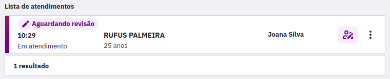

**Imagem 2:**

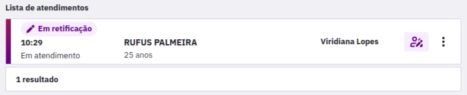

**Imagem 3:**

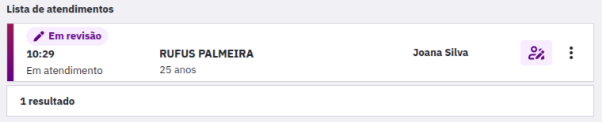

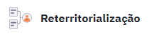

* Agora é possível atualizar rapidamente o território dos imóveis e seus respectivos núcleos familiares. Com esta nova funcionalidade, a atualização das informações que determinam a responsabilidade de acompanhamento no território poderá ser feita de uma forma rápida e consolidada, sem a necessidade de se atualizar ficha por ficha.

* Acesse a seção "Gestão de Cadastros" e a aba de Reterritorialização. Nesta tela basta realizar uma busca pelos imóveis desejados.

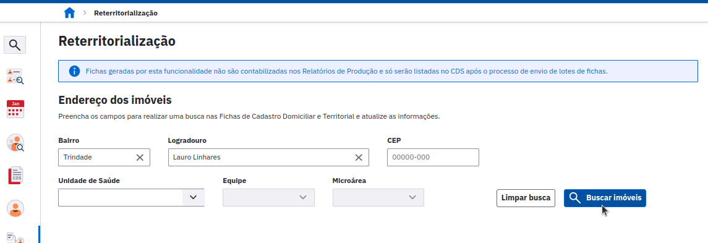

* Aí então basta selecionar na lista quais deles devem ser reterritorializados, informar os novos dados e clicar em "Atualizar imóveis".

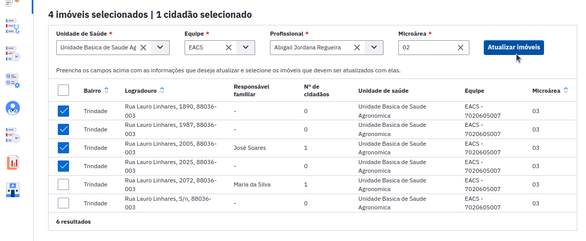

* Este processo preserva automaticamente os núcleos familiares envolvidos, gerando novas fichas de atualização assim que um novo lote de fichas for gerado e enviado.

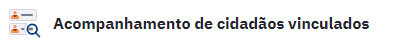

* Com o **novo acompanhamento** é possível buscar, imprimir e exportar todos os cidadãos que são acompanhados pelas equipes da unidade de saúde, até mesmo aqueles que não pertencem a um núcleo familiar, ou seja, unidades que não utilizam o CDS, poderão visualizar os cidadãos no relatório, desde que em seu cadastro esteja informada a equipe responsável pelo cidadão.

* O **Acompanhamento de cidadãos vinculados** fica em um novo menu de **Acompanhamentos**, agrupado ao **Acompanhamento de condições de saúde**.

* Por padrão, os profissionais com os perfis Coordenador da UBS, ACS, TSB, Outros profissionais de nível superior NASF, Outros profissionais de nível superior, Outros profissionais de nível médio técnico, ASB, Auxiliar ou técnico de enfermagem, Cirurgião dentista, Enfermeiro, Farmacêutico e Médico terão acesso ao novo relatório. Com exceção do Coordenador da UBS, os demais profissionais só visualizam cidadãos relacionados às suas respectivas equipes.

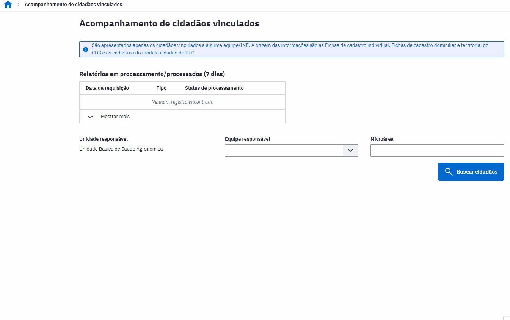

* Nova interface! O módulo foi **redesenhado** a fim de facilitar a sua utilização, mantendo estrutura do atendimento individual;

**Imagem 1:**

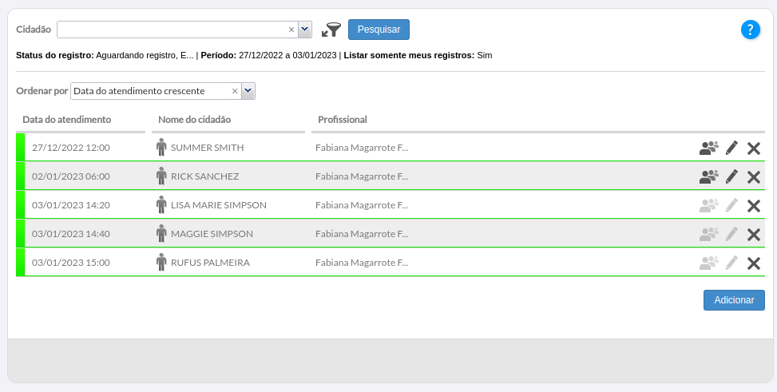

**Imagem 2:**

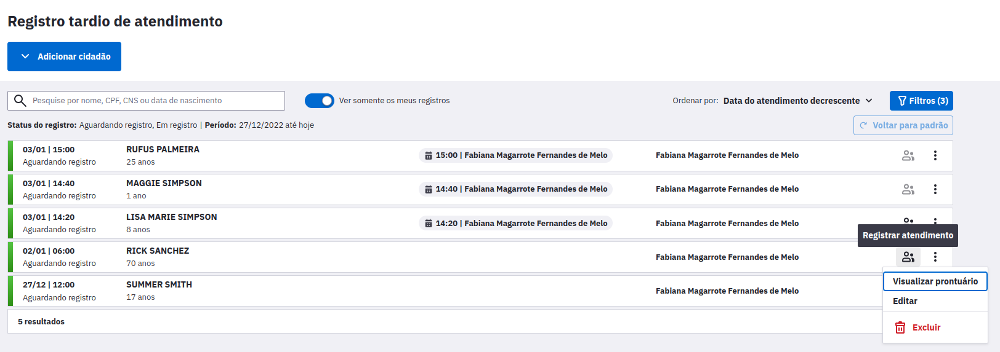

* Permissão de **agendamento do Registro tardio** quando a justificativa for **fora da UBS** através do módulo da agenda;

* Permissão de registros de atendimentos de até **7 dias anteriores a data atual** que não puderam ser registrados no dia do atendimento;

* Possibilidade de cancelar registro na própria listagem caso ele tenha excedido o prazo ou possua outro mais recente que ele;

* Ao tentar realizar um registro com atendimento mais recente, são exibidas **informações do atendimento posterior** em uma modal;

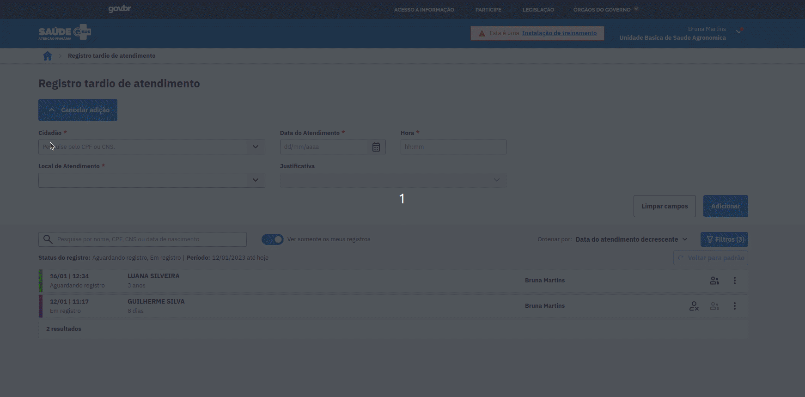

* Possibilidade de agendar um atendimento Fora da UBS na **finalização do atendimento.**

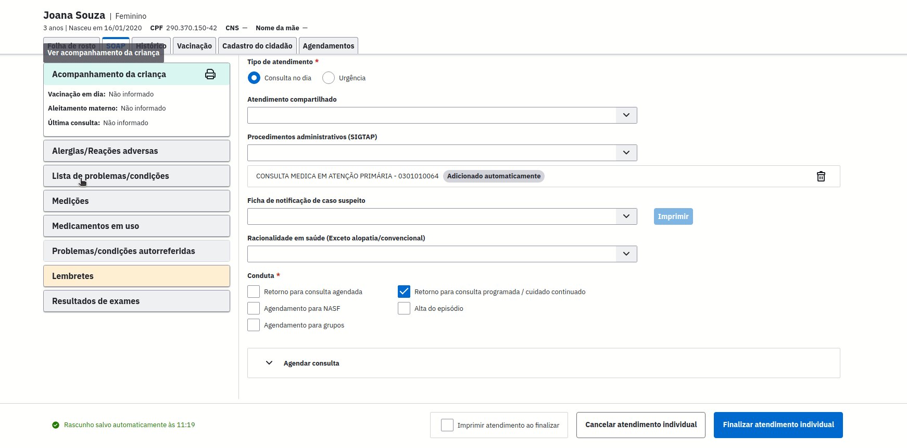

* Agora, para ter acesso ao serviço é necessário que o Administrador Municipal configure o certificado digital do município. Além disso, o usuário do CADSUS precisará realizar o login no gov.br no próprio PEC para usufruir todos os serviços disponíveis.

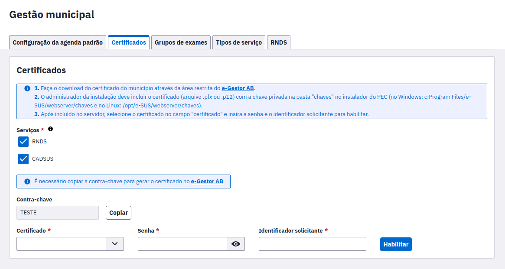

* Importante: Caso o município já tenha um certificado com a RNDS configurada, será necessário solicitar a habilitação do novo serviço do CADSUS para ele. O PEC aceita apenas um certificado, ou seja, para acessar a RNDS e o CADSUS, o mesmo certificado deverá ter ambos os serviços habilitados.

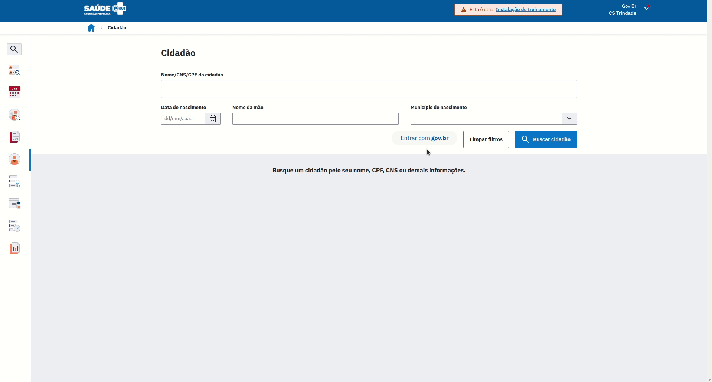

## Versões de estabilização 5.1
### Versão 5.1.25

{: .no_toc }

* Alterações e melhorias na busca de dados do Histórico clínico do cidadão visando performance.  
* Correção de erro ao gerar relatórios CSV na Busca ativa de vacinação utilizando a opção de filtros avançados. 

### Versão 5.1.24

* Correção de cenários onde o sistema apresentava erro caso houvesse cadastro do mesmo INE em mais de um estabelecimento.

### Versão 5.1.21

* Simplificação dos campos "Atendimento fora da UBS" e "Local de atendimento" no agendamento.
* Correção na lentidão encontrada na seleção de profissionais no módulo da Agenda.
* Destaque no calendário da Agenda para datas com horários disponíveis.
* Correção no relatório CSV ao aplicar os filtros avançados, para exibir todos os imunobiológicos daquele cidadão e não apenas os que foram selecionados.
* Correção de cenário onde a lotação de estagiário era impossibilitada de imprimir solicitações de exames.
* Correção na prescrição de medicamentos onde as comboboxes não fechavam após confirmar seleção com atalhos do teclado.
* Correção da exportação da série histórica nos relatórios CSV, para voltarem a apresentar o CNS dos profissionais.
* Correção do fluxo que solicitava múltiplas vezes a Justificativa de acesso ao prontuário para um mesmo cidadão.
* Retirada do item de checkbox em branco da lista do Tipo de atendimento do Histórico clínico do cidadão.
* Correção de cenário onde o sistema apresentava uma tela branca após o login para alguns usuários.
* Correção no módulo de Agenda para agendamentos exibirem o telefone do cidadão.
* Adicionada compatibilidade com a versão 3.1 do XML do CNES.
* Inclusão do perfil de Farmacêutico para realizar prescrição de medicamentos no Atendimento individual.

### Versão 5.1.20

* Correção de cenário onde nenhuma informação era apresentada no Relatório de inconsistências caso houvesse erro ao enviar fichas.
* Correção de erro onde uma tela branca era apresentada ao navegar no módulo de Reterritorialização.
* Correção do Relatório operacional de inconsistências do Cadastro territorial para exibição correta de famílias que foram reterritorializadas.
* Correção de erro onde atendimentos realizados no aplicativo e-SUS Atenção Domiciliar para cidadãos sem CPF e sem CNS não eram apresentados no histórico clínico.
* Correção de cenário onde a idade gestacional ecográfica era apresentada diferente entre a impressão e o card de acompanhamento.
* Ajustes para exibir a data em que o atendimento foi realizado na Declaração de comparecimento do Registro tardio.
* Alterações e melhorias na busca de dados do Acompanhamento de cidadãos vinculados visando performance.
* A mensagem informativa referente a lista de CID10 e CIAP2 que aumentam o risco da gravidez apresentará as CID10 apenas para profissionais que possam preencher essa informação.
* Correção do cenário onde a idade gestacional não era exibida no card do acompanhamento de pré-natal quando acessado através do módulo do cidadão.
* Correção do cenário onde não estava sendo possível imprimir o acompanhamento de pré-natal.
* Atualizado comportamento do botão para logar no gov.br para abrir uma pop-up no sistema e não mais redirecionar a página atual.
* Correção do cenário para que o risco da gestação seja alterado somente quando preenchido por médico ou enfermeiro.

### Versão 5.1.19

* Correção de erro na sincronização com o CADSUS e edição do cidadão que gerava carregamento infinito em algumas instalações.

### Versão 5.1.18

* Correção de cenário, onde não era possível adicionar um mesmo cidadão na lista de Atenção Domiciliar por diferentes profissionais.
* Ajustes na seleção de checkbox via atalho de teclado no Histórico clínico do cidadão.
* Correção do cálculo da IG eco para considerar a data atual, anteriormente apresentada de forma fixa a data informada no resultado da USG.
* Ajustes no processo de preparação e de envio de lotes.
* Correção de cenário onde era apresentado tela branca ao tentar finalizar um atendimento com condição W78 adicionada e, posteriormente, excluída na lista de problemas e condições.
* Adicionada funcionalidade de "Copiar atividade" para o tipo de atividade "5" na Ficha de atividade coletiva.
* Correção de cenário onde não era possível evoluir uma condição adicionada através do modal da Lista de problemas e condições.
* Realizados ajustes de layout visando maior visibilidade no registro de procedimentos do odontograma, além de adicionada a possibilidade de replicar procedimentos entre os dentes.
* Correção de cenário onde o histórico de resultados de exames aparecia desabilitado mesmo havendo resultados previamente registrados.

### Versão 5.1.17

* Correçã o de erro onde não era possível acessar o módulo de CBO em instalações com banco de dados Oracle.
* Ajuste de cenário onde, ao incluir CID 10 relacionado a puerpério, o tipo do atendimento será definido como puerpério.
* Correção de erro onde, a condição W78 adicionada automaticamente na lista de problemas e condições apresentava data de início incorreta, ao invés de mostrar a mesma data de início da condição de alto risco adicionada na avaliação.
* Correção de cenário onde, ao mudar a situação de uma condição de alto risco ou desfecho na avaliação, a data selecionada era alterada para o dia atual.
* Ajustes no Histórico clínico do cidadão para apresentar o nome do estagiário que realizou o atendimento.
* Ajuste no horário de entrada da declaração de comparecimento do cidadão para considerar toda a permanência do cidadão na unidade de saúde.
* Correção de erro onde a opção para baixar impressões não estava funcionando corretamente.
* Correção de cenário onde uma tela branca era apresentada ao tentar visualizar Atendimentos domiciliares com mais de um CIAP no histórico Clínico do cidadão.
* Ajustes no Histórico clínico do cidadão para exibir a concentração dos medicamentos prescritos ao lado do seu princípio ativo.
* Correção de erro onde o campo conduta era apresentado duas vezes no histórico de atendimentos de CEO.
* Incluído comportamento de carregamento no botão "Adicionar" da Lista de atendimentos.
* Correção no Histórico clínico do cidadão ao tentar visualizar registros de Atendimento domiciliar sem procedimento.
* Correção do cenário em que um mesmo imóvel era listado incorretamente múltiplas vezes no módulo de Reterritorialização.
* Correção de erro onde o botão de importar CNES do módulo de Unidades de saúde não estava funcionando.
* Melhoria no layout dos Exames solicitados no Histórico clínico do cidadão.
* Correção de erro onde não era possível finalizar atendimentos de pré-natal em instalações com banco de dados Oracle.
* Ajustes no processamento de dados para o acompanhamento de cidadãos vinculados ocorrer apenas no horário configurado para geração de lotes e processamento de fichas.

