# Versão 5.2
## Novidades:

* Acompanhamento do Território
* Busca ativa de vacinação
* Cuidado Compartilhado
* e-SUS APS Ampliado
* Facilidades no agendamento de consultas de pré-natal
* Gerenciamento de cookies
* Gestão da garantia do acesso
* Histórico do Cuidado Compartilhado
* Prescrição de medicamentos
* Prescrição digital
* RNDS - Envio de vacinas e atendimentos individuais
* Videochamadas
* Unificação de cadastros
* Vínculo entre equipes do PEC

 

* A versão 5.2 permite visualizar os cadastros sob responsabilidade da sua equipe de forma mais intuitiva, facilitando a gestão do seu território adscrito e a formação de núcleos familiares. Basta acessar a aba "Território" na seção Acompanhamentos e conferir as novidades.

* Nessa tela, você verá imóveis e seus moradores organizados por microáreas e logradouros, assim como os respectivos índices e filtros de cadastros completos e atualizados. Outras informações de apoio também estarão lá, como data da última visita e possíveis inconsistências de cadastro.

* Além disso, é possível corrigir eventuais divergências de cadastro através da edição de logradouro, que cria automaticamente atualizações para os imóveis do mesmo, possibilitando a higienização da sua base de cadastros.

 

* Inclusão do Grupo-alvo de Gestantes/puérperas para Vacinas da Covid-19;
* Inclusão do Grupo-alvo de Gestantes para Vacinas do calendário vacinal;
* Inclusão do Grupo-alvo de Idosos para Vacinas do calendário vacinal;
* Inclusão do filtro por Faixa etária em cada grupo-alvo disponível para Vacinas do calendário vacinal e Vacinas de Covid-19;
* Inclusão do filtro por Grupo de atendimento para Vacinas da Covid-19;

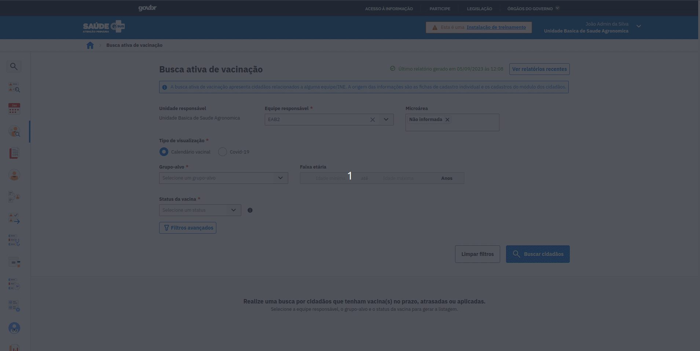

* Exportação do relatório da busca ativa no formato PDF para impressão e download das Vacinas do calendário vacinal e Vacinas da Covid-19.

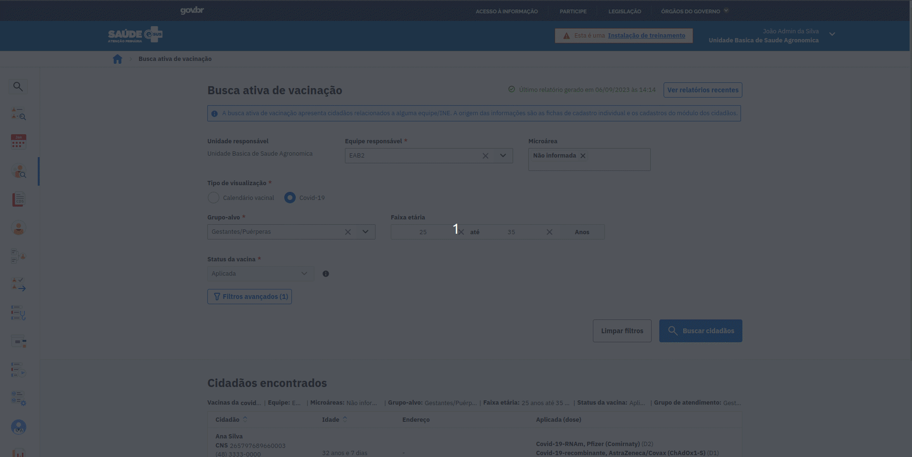

 

* Todas as Equipe de Saúde da Família (ESF) ou Equipe de Saúde Bucal (ESB) que possuírem vinculo através do CNES com equipes multidiscplinares (eMulti) ou equipes de Núcleos de Apoio à Saúde da Família (NASF) terão acesso na seção do Plano de atendimentos individuais e de atendimentos odontológicos a nova aba de Compartilhamento do Cuidado. O objetivo do compartilhamento de cuidado é possibilitar que o profissional da APS discuta o caso clínico do cidadão com um profissional da equipe eMulti ou NASF.

* Contextualização: O profissional solicitante é quem iniciou o cuidado compartilhado e o profissional executante é o profissional de referência que foi indicado para discutir o caso.

* O PEC conta com alguns módulos novos para que o profissional solicitante e o profissional executante consigam conversar sobre o caso clínico do cidadão. Através do menu lateral, dentro da opção "Gestão de filas" existe a opção "Cuidados Compartilhados". Existem duas listagens no módulo de "Cuidados Compartilhados":

Figura 1:

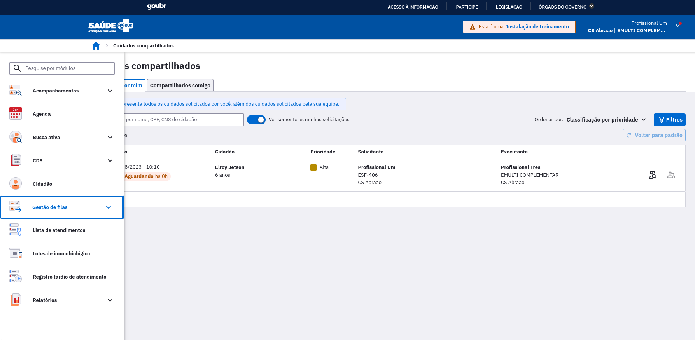

Figura 2:

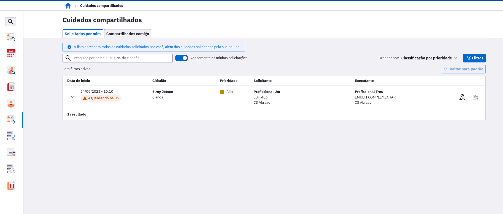

Figura 3:

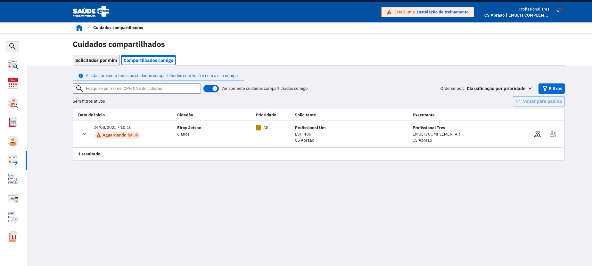

* "Solicitados por mim" que exibe todos os cuidados solicitados pelo usuário, além dos cuidados solicitados pela equipe do usuário.
* "Compartilhados comigo" que exibe todos os cuidados compartilhados com o usuário e com a equipe do usuário.
* As colunas das tabelas são iguais em ambas as listagens, sendo que todas as linhas possuem um status ("Respondido" e "Aguardando") e duas ações possíveis ("Visualizar discussão" e "Discutir caso"). As seguintes regras serão aplicadas:

 

* Na aba "Solicitados por mim" o usuário só poderá clicar em "Discutir caso" caso tenha solicitado aquele compartilhamento e caso o status seja "Respondido";

* Na aba "Compartilhados comigo" o usuário só poderá clicar em "Discutir caso" caso aquele compartilhamento tenha sido compartilhado com ele e caso o status seja "Aguardando";

* Sempre que o status for "Aguardando" o sistema exibirá um contador de horas que exibirá há quantas horas aquela discussão está aguardando resposta;
    
* O botão "Visualizar discussão" poderá ser acessado por todos os profissionais de nível superior da equipe do profissional solicitante ou do profissional executante.

* A listagem possui os seguintes filtros para facilitar na organização e busca da lista de Cuidados compartilhados:

    * Filtro para buscar o cidadão pelo nome, CPF ou CNS;

    * Botão para "Ver somente as minhas solicitações" na aba "Solicitados por mim" e "Ver somente cuidados compartilhados comigo" na aba "Compartilhados comigo";

    * Combo de filtros que permite indicar qual o status, período e profissionais que deverão ser exibidos na listagem;

    * Alterar a ordenação da lista por classificação de prioridade ou status.

 

* Ao acessar o módulo de "Discutir caso" o sistema exibirá três abas: "Folha de rosto", "Histórico" e "Discussão do caso". As duas primeiras abas são idênticas às abas de um atendimento. A aba de "Discussão de caso" conta com:

Figura 1:

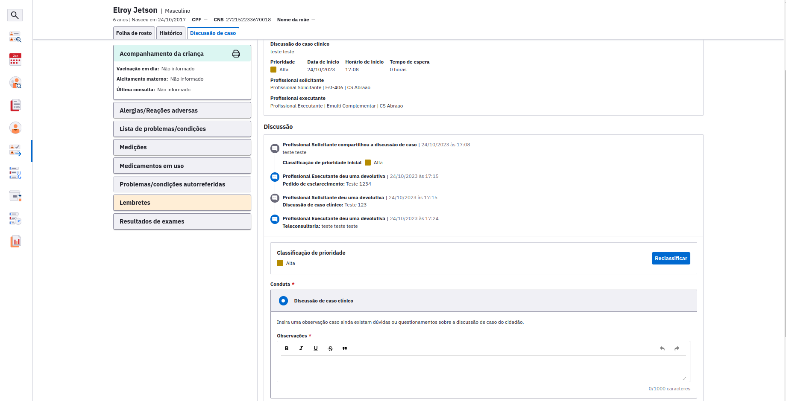

Figura 2:

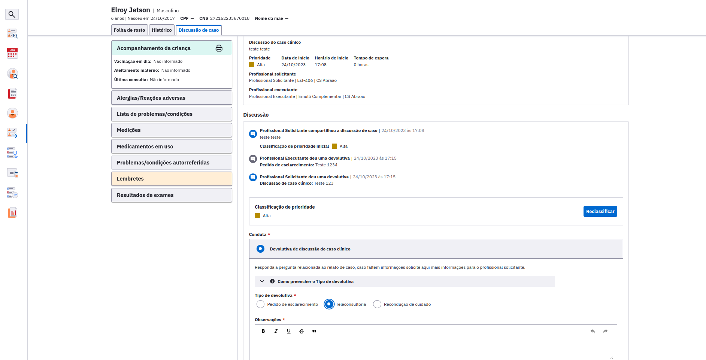

* Um resumo com todas as informações inseridas no momento de criação do cuidado compartilhado;
* Um histórico com todas as respostas para aquela discussão;
* Uma seção de condutas para serem adotas:

    * Conduta "Devolutiva de discussão do caso clínico" para o profissional executante devem existir quatro tipos de devolutiva "Pedido de esclarecimento", "Teleconsultoria" e "Recondução de cuidado" sendo obrigatório inserir observações sobre a devolutiva;

    * Para o profissional solicitante a conduta "Devolutiva de discussão do caso clínico" possui um formato diferente, sendo possível inserir uma nova observação sobre a discussão;
    
    * Conduta "Agendar consulta" possibilita o agendamento de consultas com cidadão;
    
    * Conduta "Trocar profissional de referência" possibilita trocar o profissional executante da discussão. Após a troca somente o novo executante poderá participar da discussão.
    
    * A conduta "Sugerir agendamento para grupos" tem o propósito de sugerir a participação do cidadão em grupos de atividades coletivas.
    Conduta "Reclassificação de prioridade", confere ao profissional alterar a classificação de prioridade do cuidado compartilhado.

* A lógica é sempre de pergunta e resposta, portanto o solicitante sempre envia uma dúvida que será respondida pelo executante. Esse ciclo poderá ser repetido até todas as dúvidas serem sanadas. As únicas exceções são quando:

    * Profissional solicitante faz um agendamento, pois não é gerada uma nova pergunta para o executante responder, por consequência o status da discussão continua "Respondido".

    * Quando o profissional solicitante ou executante optam por reclassificar a prioridade do cuidado compartilhado, a conduta "Reclassificação de prioridade" requer sempre uma segunda conduta adicional para promover a evolução da discussão e alterar seu status.

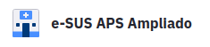

* O e-SUS APS Ampliado passará a reconhecer alguns novos estabelecimentos no sistema.

 

Com a nova funcionalidade de agendamentos, durante um atendimento de pré-natal, será possível realizar o agendamento da próxima consulta para acompanhamento de pré-natal e a consulta odontológica de pré-natal. O PEC irá sugerir a data e lotação de profissional, sendo que a pessoa responsável pelo atendimento tem liberdade para alterar essas informações conforme disponibilidade das partes envolvidas.

* Para o acompanhamento de pré-natal, a data da próxima consulta é sugerida conforme a idade gestacional, respeitando as cadências estipuladas na caderneta da gestante, enquanto a lotação de profissional alterna entre profissionais com CBO de médico e enfermeiro.

* Para as consultas odontológicas, é sugerida uma consulta a cada trimestre da gestação, enquanto a lotação de profissional sugerida será de profissional com CBO de dentista.

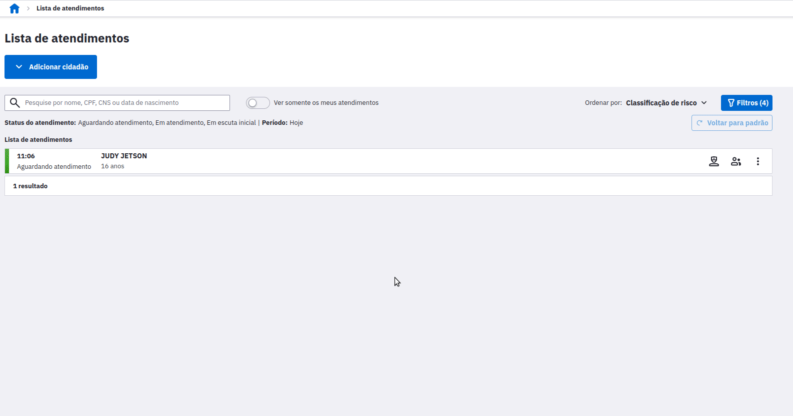

* Ainda durante os atendimentos de pré-natal, serão apresentadas as sugestões de quais serão todas as datas que deverão ocorrer os próximos acompanhamentos de pré-natal, bem como um atendimento odontológico a cada trimestre da gestação.

## Gerenciamento de cookies

A partir desta atualização, é possível gerenciar os cookies recolhidos pelo PEC. Os cookies são utilizados para melhorar a experiência no sistema e permitir serviços personalizados. Agora, além de estar ciente dos cookies recolhidos, você pode escolher quais quer autorizar clicando em "Configurar cookies". Para saber mais, acesse Termos de uso e Políticas de privacidade.

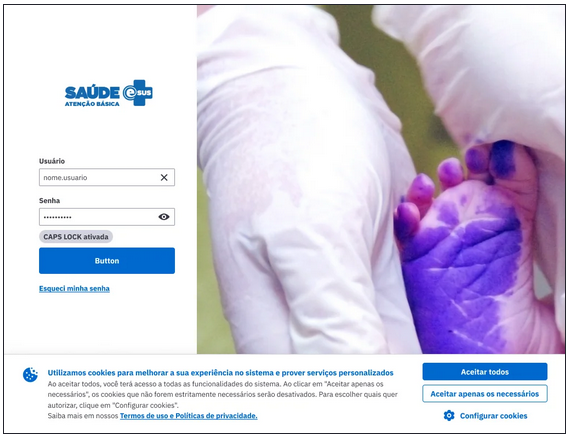

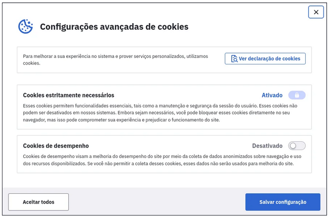

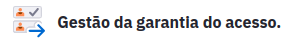

O PEC passa a contar com o novo módulo de Gestão da garantia do acesso, cujo objetivo é permitir que os profissionais criem uma lista para gerir a demanda reprimida dos estabelecimentos de saúde. Através do módulo, poderão ser visualizados os contatos e demandas dos cidadãos que buscaram atendimento e não conseguiram acesso imediato ao serviço, podendo então direcioná-los para um possível agendamento futuro.

Dentre as principais funcionalidades e implementações realizadas no novo módulo, temos:

* Agendamento de consulta para o cidadão de forma direta através do seu registro na Gestão da garantia do acesso;
* Filtragem da lista de registros através dos campos de cidadão, equipe e tipo de atendimento ou de serviço;
* Edição dos registros da lista;
* Adaptação do módulo para os Centros de Especialização Odontológica (CEO).

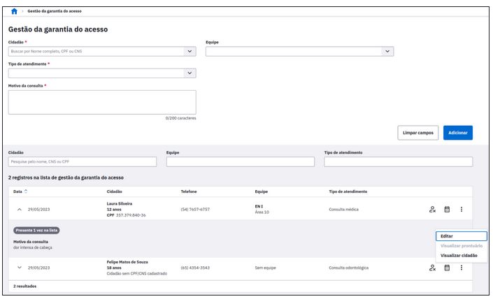

* Durante um atendimento, independente do tipo (consulta, pré-natal, puericultura, etc.), quando for gerado um compartilhamento de cuidado, será apresentado um novo bloco dentro do histórico desse atendimento.

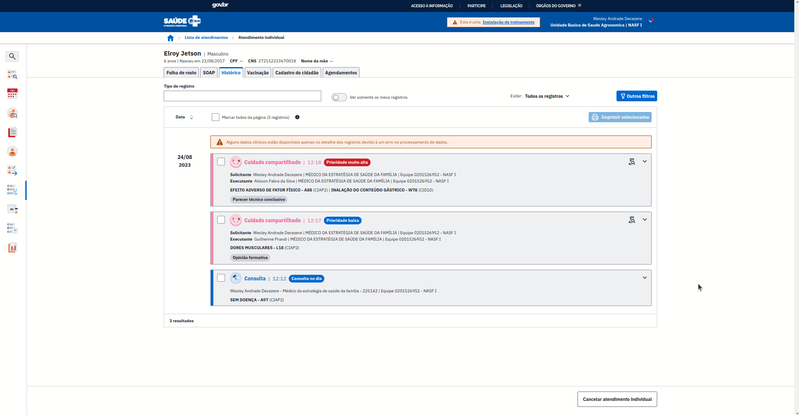

* Todos os eventos de evolução do compartilhamento de cuidado irão gerar novos itens dentro do histórico do cidadão. A cada interação, seja do profissional solicitante ou do executante, um novo registro será apresentado no histórico.

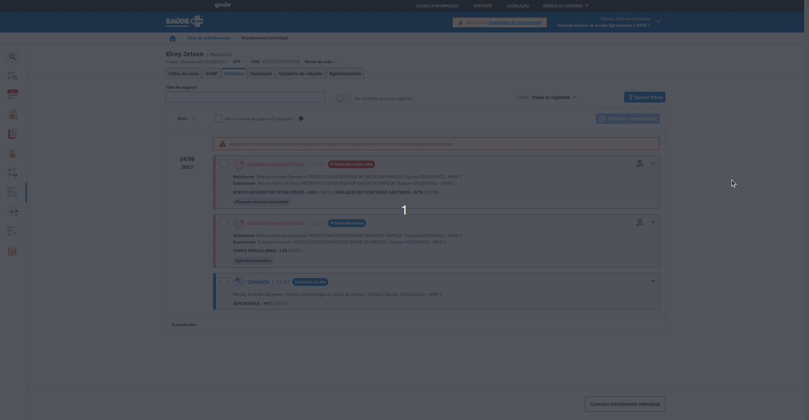

* Será possível imprimir o registro de cuidado compartilhado.

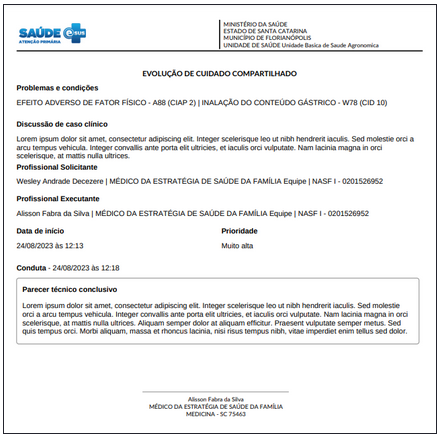

## Prescrição de medicamentos

* Com objetivo de qualificar os dados do PEC, a informação da dose na prescrição de medicamentos foi dividida em dois campos:

    * Quantidade da dose: Quantidade da dose prescrita. Para doses fracionadas, utilize vírgula ou barra. Exemplos: "0,5", "1/2", etc.

    * Unidade de medida: Unidade de medida para consumo do medicamento prescrito. Exemplos: "comprimido", "ml", "sachê", etc.

* Lembre-se de utilizar o campo "Recomendações" para inserir demais informações relevantes na utilização do medicamento.

* Para replicar prescrição ou replicar medicamento, é necessário atualizar a informação da dose nos novos campos. A informação original será exibida no alerta da prescrição.

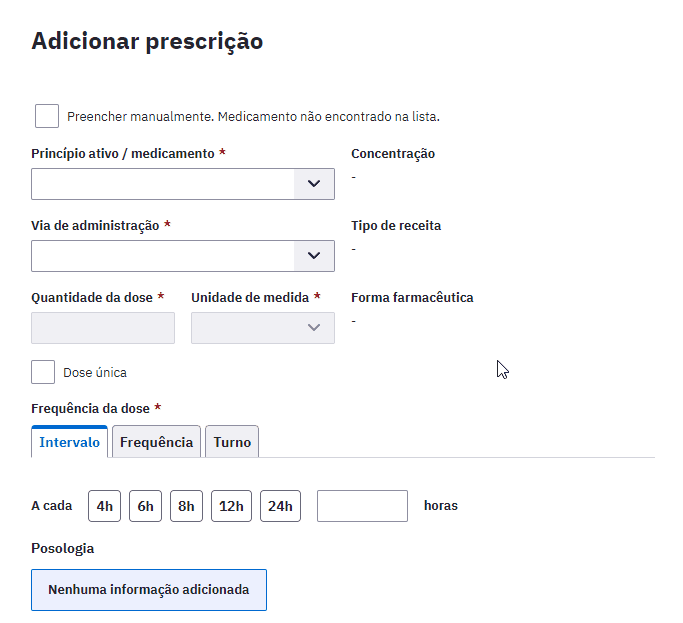

* Ao encaminhar a prescrição de medicamentos para o cidadão, será possível optar por realizar a impressão ou gerar uma prescrição digital através da opção “Prescrição digital”, caso a instalação esteja habilitada para gerar prescrições digitais. O documento da prescrição digital será gerado no formato PDF e enviado ao cidadão, que poderá utilizá-lo para retirar medicamentos. Na farmácia, será possível registrar que os medicamentos da prescrição foram fornecidos. Para utilizar a funcionalidade é necessário ativar a integração com o servidor de Prescrição digital.

* A prescrição digital será encaminhada ao cidadão via e-mail. É possível editar o endereço de e-mail do cidadão antes de encaminhar clicando no ícone de edição ao lado do campo.

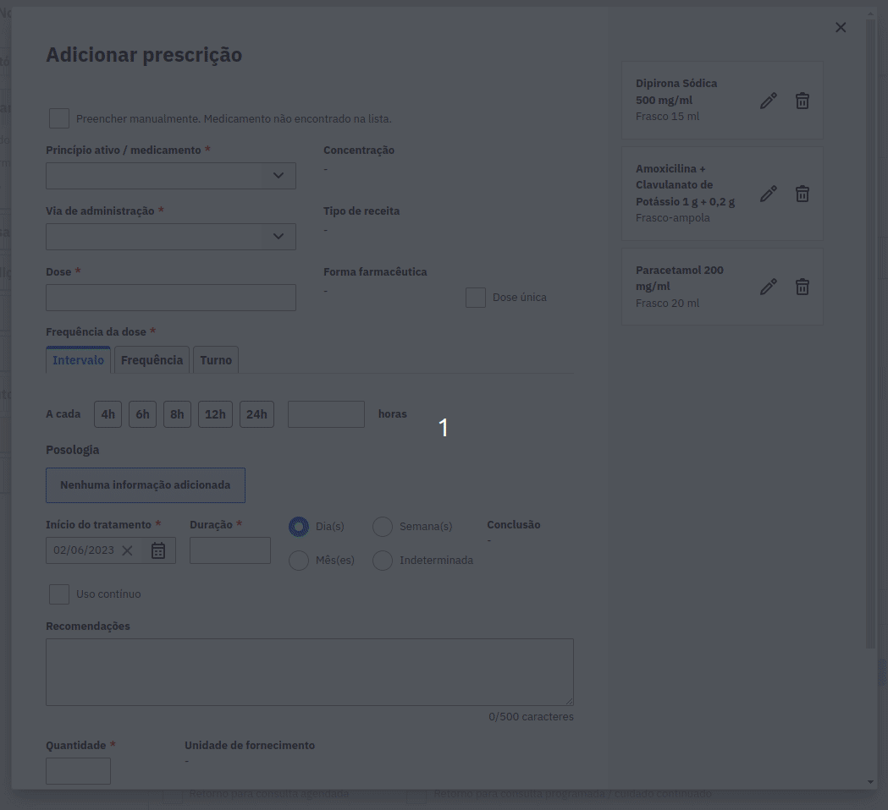

* Para gerar a prescrição digital, é necessário realizar uma assinatura eletrônica do documento. O PEC irá abrir uma nova janela para o processo de assinatura.

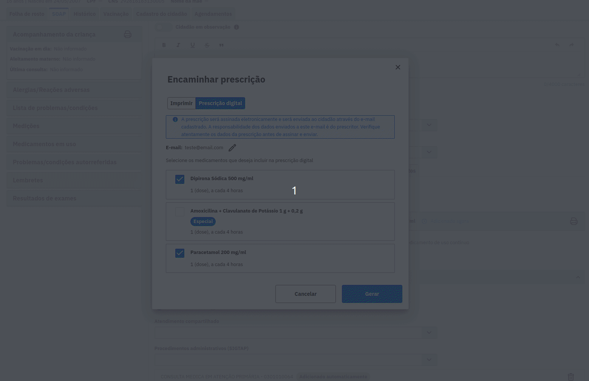

## RNDS - Envio de vacinas e atendimentos individuais

* Para as instalações com a RNDS configurada, os seguintes registros serão enviados à Rede Nacional de Dados em Saúde (RNDS):

    * Vacinação: Envio ao finalizar o atendimento de vacinação. As transcrições de caderneta também serão enviadas, tanto as cadastradas no atendimento de vacinação quanto no atendimento individual.

    * Atendimentos individuais: Envio ao finalizar o atendimento individual. Atendimentos em que o cidadão ficou em observação também serão enviados após sua finalização.

* Nova página para visualização da quantidade de registros enviados, localizada no módulo de "Gestão municipal", aba "RNDS". A página exibe informações sobre os envios dos registros de vacinação e atendimentos individuais.

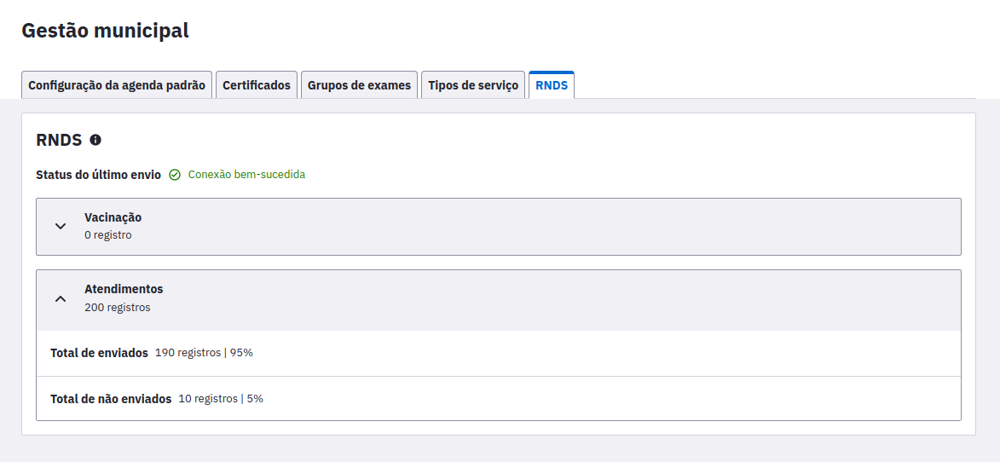

A partir desta atualização, é possível realizar videochamadas diretamente no PEC através do novo módulo Videochamadas e-SUS APS que oferece um canal oficial de comunicação aos usuários! A ferramenta conta com a possibilidade de conexão entre duas pessoas, compartilhamento de tela, picture-in-picture e chat.

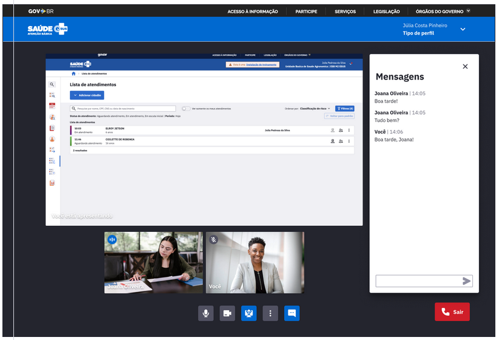

Para utilizar essa nova funcionalidade, é necessário que o acesso à instalação seja feito utilizando o protocolo HTTPS e que o Administrador da Instalação habilite as videochamadas nas configurações de internet:

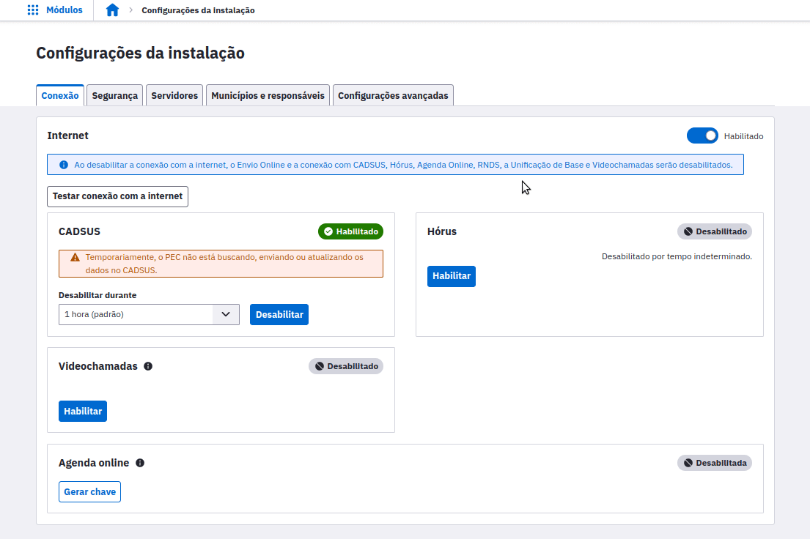

Depois disso, basta que seja criada uma nova chamada no módulo Videochamadas e que seja enviado o link de acesso para o convidado, seja ele usuário do PEC ou não.

Figura 1:

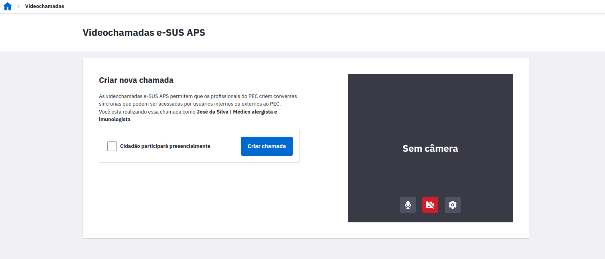

Figura 2:

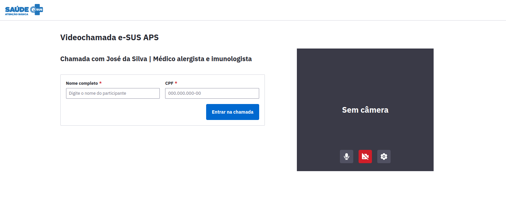

* Com a nova funcionalidade de Exportar cadastros duplicados, agora é possível exportar relatórios no formato CSV com os prováveis cadastros de cidadãos duplicados.

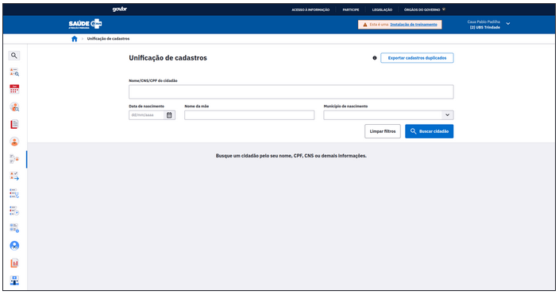

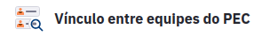

* Visando possibilitar que profissionais que atuam em equipes especialistas (por exemplo a ESB) possam visualizar dados de cidadãos vinculados a equipes como ESF, EAP, entre outras. Com a nova versão do XML do CNES (3.1), será possível importar o vínculo que existe entre as equipes. Após a importação, é possível visualizar os vínculos na aba de equipes dentro do cadastro de unidades de saúde.

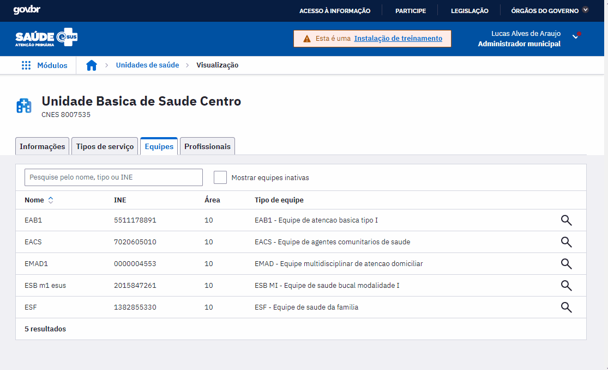

* Alguns relatórios do sistema foram adaptados para considerar o vínculo entre as equipes. Dessa forma, quando um profissional pertencente a uma equipe vinculada a outra consultar as informações, mesmo que o cidadão não seja acompanhado por sua equipe, o relatório será apresentado.

    * Acompanhamento de cidadãos vinculados
    * Acompanhamento de condições de saúde
    * Relatório operacional de crianças menores de 5 anos
    * Relatório operacional de gestante/puérpera
    * Relatório operacional de risco cardiovascular
    * Relatório operacional de cadastro territorial
    * Relatório consolidado de cadastro domiciliar e territorial
    * Relatório consolidado de cadastro individual
    * Relatório consolidado de situação do território
    * Busca ativa de vacinação

* Os relatórios impactados apresentam a mensagem da imagem abaixo em seu cabeçalho:

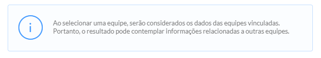

