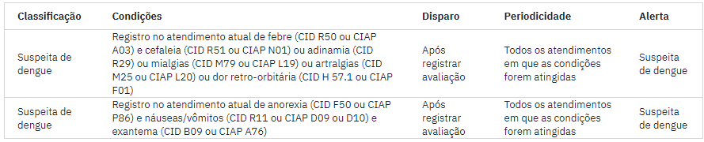
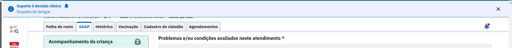
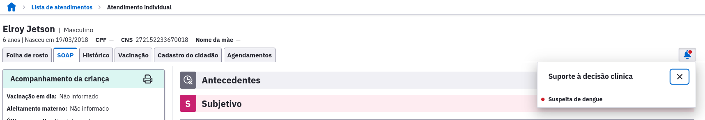

# Versão 5.3
## Novidades:

* Busca ativa de vacinação
* Cadastro de Imóveis e Famílias
* Suporte à Decisão Clínica
* Videochamada do profissional convidado adaptada para telefone celular

**Busca ativa de vacinação**

* Implementação do Grupo-alvo de Adultos para Vacinas do calendário vacinal;
* Implementação do Grupo-alvo de Puérperas com Gestantes para Vacinas do calendário vacinal;
* Unificação dos Grupos-alvo de Gestantes e Puérperas para Vacinas do calendário vacinal;
* Inclusão do filtro por Bairro, Tipo de Logradouro e Logradouro de residência do cidadão;
* Inclusão da regra de Identidade de gênero nos relatórios.

**Inclusão dos grupos alvos:**

Inclusão do **bairro** nos filtros avançados:

**Cadastro de Imóveis e Famílias**

* A versão 5.3 agora permite cadastrar imóveis e famílias de forma mais completa e clara, facilitando a gestão dos cidadãos moradores de cada domicílio adscrito.

* A funcionalidade de Acompanhamento do Território, no menu lateral, foi evoluída para permitir cadastrar e atualizar os imóveis e famílias, condições de moradia e responsabilidades de acompanhamento, tudo isso em uma única interface moderna e intuitiva, sem a necessidade de gerar várias Fichas CDS manualmente. O sistema as gerará automaticamente, apenas para que a sua produção seja consolidada em relatórios e enviada ao Centralizar Nacional.

* Também será possível visualizar e corrigir inconsistências de cadastro através das novas telas, sem a necessidade de se aguardar o processamento após o Envio de Lotes de Fichas.

**Suporte à Decisão Clínica**

* Agora o PEC conta com um sistema de Suporte à Decisão Clínica que objetiva notificar os profissionais durante os atendimentos dos cidadãos. Os alertas apresentados por esse sistema servem de apoio à tomada de decisão e não possuem caráter prescritivo por si só. No momento, foram implementados dois alertas:

* Assim que uma condição for atingida o alerta será disparado e uma notificação deve ser gerada no botão de suporte à decisão clínica que fica na direita superior da tela.

Suporte à decisão 1:

Suporte à decisão 2:

Suporte à decisão 3:

**Videochamada do profissional convidado adaptada para telefone celular**

* Os componentes da videochamada foram adaptados para funcionar em telefones celular. O objetivo do módulo é possibilitar que o profissional convidado acesse a videochamada pelo telefone celular. Por outro lado, o profissional anfitrião ainda deve acessar a videochamada através do computador.

* As funcionalidades da videochamada para telefone celular são:

    * Ativar e desativar camera;
    * Ativar e desativar microfone;
    * Chat.

