<head>
    
</head>

# Versão 5.3

## Novidades - Ferramentas relacionadas aos cuidados

Acompanhamento do Território:
- A funcionalidade foi evoluída para permitir cadastro e atualização dos imóveis e famílias diretamente pelo PEC, sem a necessidade utilização do módulo CDS
- Possibilidade de visualização e correção de inconsistências de cadastro sem a necessidade de se aguardar o processamento após o envio de lotes;
- Nova localização do imóvel "Periurbana" adicionada além das tradicionais "Urbana" e "Rural".
- Implementação da possibilidade de alterar unidade e equipe responsáveis pelos imóveis visualizados no Acompanhamento do Território;
- Implementação da opção de Recusa de cadastro nos imóveis cadastrados via Acompanhamento do Território;
- Inclusão da funcionalidade de exportar um arquivo CSV com informações da microárea e filtros aplicados, permitindo a manipulação dos dados;
- Implementação de filtros por condições de moradia nos imóveis visualizados no Acompanhamento do Território;
- Implementação de Identificação de possíveis cadastros duplicados de imóveis, com recomendação de atualização no registro existente;
- Possibilidade de realizar a sincronização do Aplicativo e-SUS Território com o PEC logo após a realização dos cadastros de imóveis e famílias, sem a necessidade de aguardar o processamento após o envio de lotes;
- Visualização das anotações das visitas domiciliares registradas no Aplicativo e-SUS Território através do detalhamento das visitas na aba "Últimas visitas;
- Visualização da geolocalização dos imóveis e visitas domiciliares quando registradas pelo Aplicativo e-SUS Território com geolocalização ativa;
- Mudança no layout de visualização dos imóveis e seus detalhes como as novas abas: "Informações cadastrais", "Famílias e moradores", "Últimas visitas";

Acompanhamento das condições de saúde: 
- Inclusão da visualização, de até 7 dias, dos relatórios que foram processados e que estão em processamento e inclusão da exportação do relatório em formato CSV, permitindo a manipulação dos dados;

Cuidado Compartilhado:

- Garantia do Acesso no Cuidado Compartilhado;
- Participação do cidadão e atendimento compartilhado; 
- Inclusão de novas opções de condutas na discussão de caso no Cuidado Compartilhado.

Demais inovações:
- Busca ativa de vacinação;
- Videochamada do profissional convidado adaptada para telefone celular;
- Videochamada do profissional convidado adaptada para tablet;
- Agendamento entre profissionais;
- Inclusão do nome social do profissional;
- Acesso rápido na agenda e aviso quando o cidadão foi a óbito;
- Fracionamento de doses diárias na prescrição de  medicamentos;
- Atestado Digital;
- Acompanhamento de vulnerabilidade.

## Novidades - Ferramentas Administrativas

- Unificação de bases;
- Configuração HTTPS automatizada;
- API para recebimento de lotes dos Sistemas Próprios/Terceiros; 
- Histórico de acessos;
- Bloqueio padrão da conta de usuário foi atualizado de 10 para 5 tentativas inválidas de autenticação 
- Atualização de terminologias dos envios à RNDS;
- Relatório de erros retornados pela RNDS;
- Importar beneficiários do Bolsa Família;
- Inclusão do nome social do profissional.

**Acompanhamento do Território - Cadastro de Imóveis e Famílias**  

* A funcionalidade de Acompanhamento do Território, no menu lateral, foi evoluída para permitir cadastrar e atualizar os imóveis e famílias, condições de moradia e responsabilidades de acompanhamento, tudo isso em uma única interface moderna e intuitiva, sem a necessidade de gerar várias Fichas CDS manualmente. O sistema as gerará automaticamente, apenas para que a sua produção seja consolidada em relatórios e enviada ao Centralizar Nacional.

* Nova localização do imóvel "Periurbana" adicionada além das tradicionais "Urbana" e "Rural".

* Mudança no layout de visualização dos imóveis e seus detalhes como as novas abas: "Informações cadastrais", "Famílias e moradores", "Últimas visitas".

* Também será possível visualizar e corrigir inconsistências de cadastro através das novas telas, sem a necessidade de se aguardar o processamento após o Envio de Lotes de Fichas.

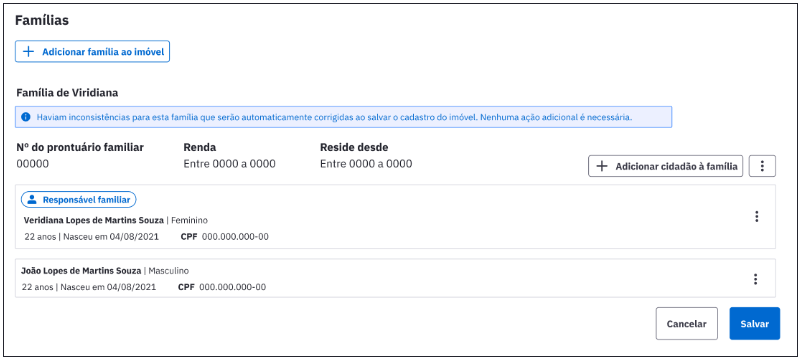

* É possível alterar a equipe e unidade responsáveis pelos imóveis no Acompanhamento do Território. 

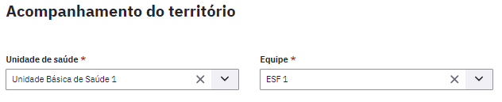

* Implementação da opção de Recusa de cadastro nos imóveis cadastrados via Acompanhamento do Território;

Ao selecionar que o cidadão recusou o cadastro por meio do Termo de Recusa do Cadastro, abrirá uma tela de aviso reforçando que esta recusa de cadastro não implica no não atendimento do cidadão na unidade de saúde. 

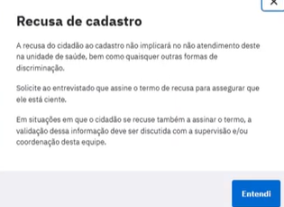

* Inclusão da exportação do relatório em formato CSV com informações da microárea e filtros aplicados, permitindo a manipulação dos dados.

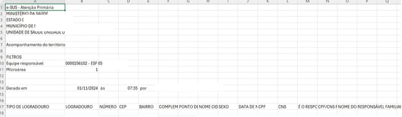

* Implementação de filtros por condições de moradia nos imóveis visualizados no Acompanhamento do Território.

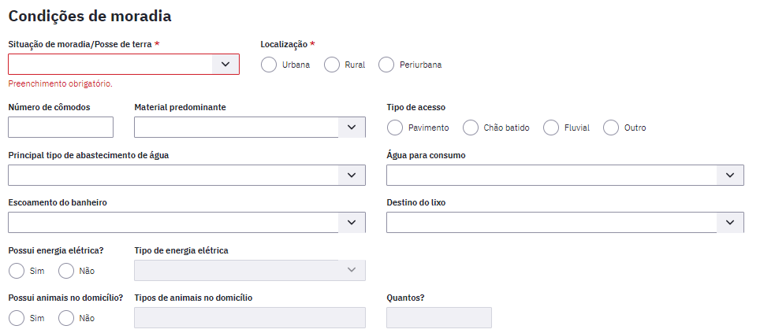

* Implementação de Identificação de possíveis cadastros duplicados de imóveis, com recomendação de atualização no registro existente.

Ao tentar cadastrar um imóvel que já tenha cadastro, o sistema apresentará um alerta orientando que já existe.

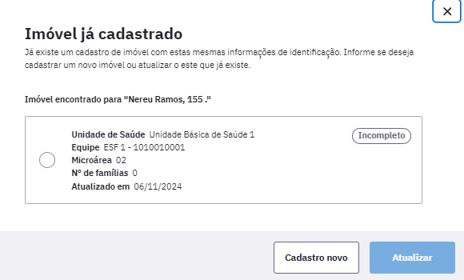

Para mais informações acesse o Capítulo [Acompanhamento do Território](https://saps-ms.github.io/Manual-eSUS_APS/docs/PEC/PEC_10_acompanhamento_condicoes_saude/#acompanhamento-do-territ%C3%B3rio)

[**Acompanhamento das condições de saúde**](https://saps-ms.github.io/Manual-eSUS_APS/docs/PEC/PEC_10_acompanhamento_condicoes_saude/#acompanhamento-do-territ%C3%B3rio)

* Inclusão da exportação do relatório de busca em formato CSV, permitindo a manipulação dos dados.

* Inclusão da visualização, de até 7 dias, dos relatórios que foram processados e que estão em processamento.

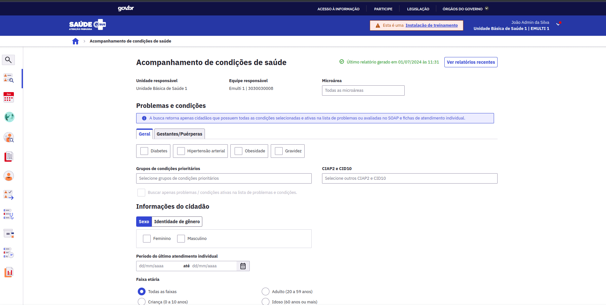

**Garantia do Acesso no Cuidado Compartilhado**

Ao receber uma solicitação de cuidado compartilhado no sistema, caso o profissional opte pela conduta de agendar consulta e não haja disponibilidade de datas e horários no momento do agendamento, é possível utilizar a opção de "Enviar para a Garantia do Acesso" através do compartilhamento do cuidado.  

Dessa forma, o cidadão permanece na fila para um atendimento com a categoria profissional que necessita. Ao buscar por aquele registro no módulo de Garantia do Acesso, é exibido que ele tem como origem o módulo de Cuidado Compartilhado.

**Participação do cidadão e atendimento compartilhado**

É possível identificar, em "finalização do atendimento" se o cidadão participou do atendimento registrado e de que forma se deu essa participação (presencial, chamada de vídeo, chamada de voz, e-mail, mensagem, outro). 

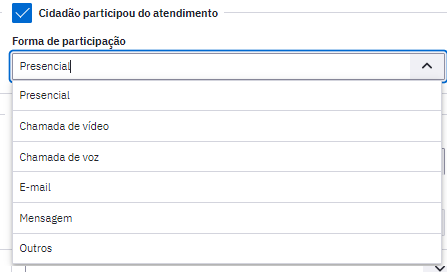

Além de informar se outro profissional participou do atendimento, agora também é possível caracterizar a forma ele participou (presencial, chamada de vídeo, chamada de voz, e-mail, mensagem, outro).

**Inclusão de novas opções de condutas na discussão de caso**

•	Conduta "Enviar para garantia de acesso" permite ao profissional executante registrar e enviar uma demanda para a Garantia de Acesso; 

•	Conduta "Agendar consulta entre profissionais" possibilita o agendamento de consulta entre o profissional solicitante e executante sem a presença do cidadão; 

•	Conduta "Agendar consulta entre profissionais via videochamada" possibilita o agendamento de consulta via videochamada entre o profissional solicitante e executante sem a presença do cidadão; 

•	Conduta "Agendar consulta entre profissionais com o cidadão" possibilita o agendamento de consulta entre o profissional solicitante e executante com a presença do cidadão; 

•	Conduta "Agendar consulta entre profissionais com o cidadão via videochamada" possibilita o agendamento de consulta via videochamada entre o profissional solicitante e executante com a presença do cidadão. 

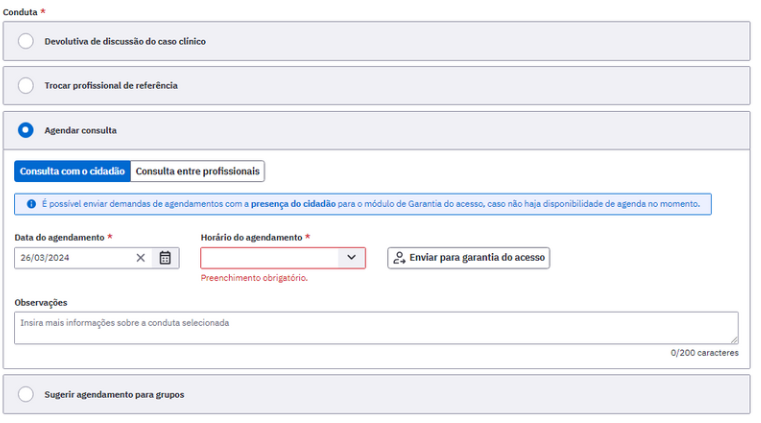

Para saber maiores informações sobre o Cuidado Compartilhado clique no [LINK](https://saps-ms.github.io/Manual-eSUS_APS/docs/PEC/PEC_14_compartilhamento_do_cuidado/)

**Busca ativa de vacinação**

* Implementação do Grupo-alvo de Adultos para Vacinas do calendário vacinal;
* Implementação do Grupo-alvo de Puérperas com Gestantes para Vacinas do calendário vacinal;
* Unificação dos Grupos-alvo de Gestantes e Puérperas para Vacinas do calendário vacinal;
* Inclusão do filtro por Bairro, Tipo de Logradouro e Logradouro de residência do cidadão;
* Inclusão da regra de Identidade de gênero nos relatórios;
* Histórico de acessos ao sistema.

**Inclusão dos grupos alvos:**

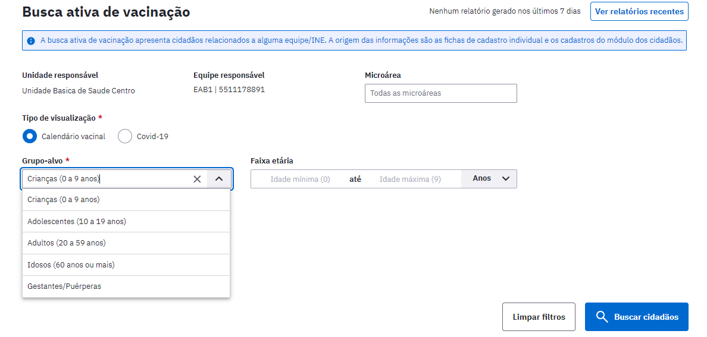

Inclusão do **bairro** nos filtros avançados:

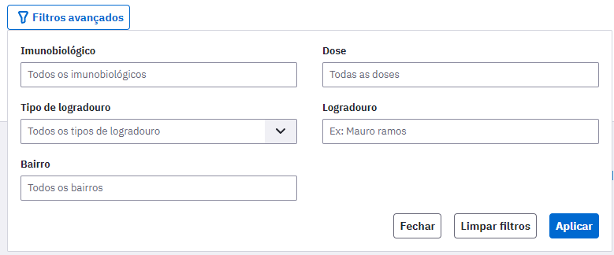

**Videochamada do profissional convidado adaptada para telefone celular**

* Os componentes da videochamada foram adaptados para funcionar em telefones celular. O objetivo do módulo é possibilitar que o profissional convidado acesse a videochamada pelo telefone celular. 

* Por outro lado, o profissional anfitrião ainda deve acessar a videochamada através do computador.

* As funcionalidades da videochamada para telefone celular são:

    * Ativar e desativar camera;
    * Ativar e desativar microfone;
    * Chat.

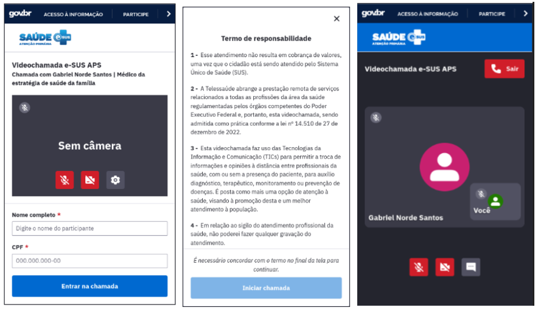

**Videochamada do profissional convidado adaptada para tablet**

* Os componentes da videochamada foram adaptados para funcionar corretamente em tablets. O objetivo do módulo é adaptar as telas da videochamada para tablet. Todas as funcionalidades da videochamada foram mantidas.

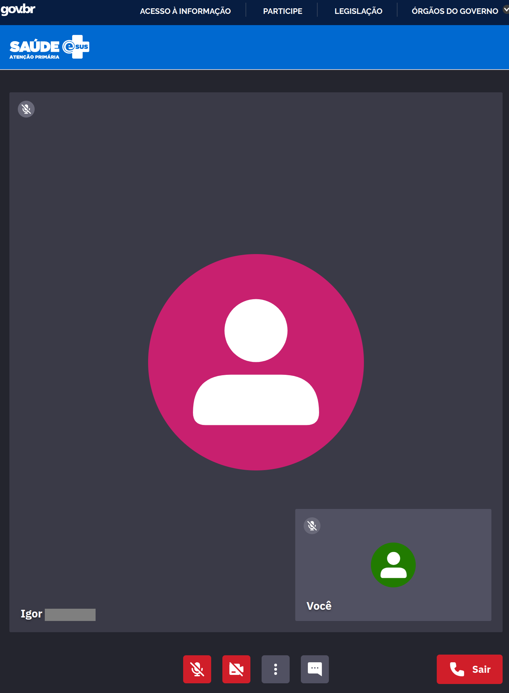

**Agendamento entre profissionais**

Esta nova funcionalidade permite o agendamento entre profissionais, inclusive por videochamada e incluir ou não a participação do cidadão.

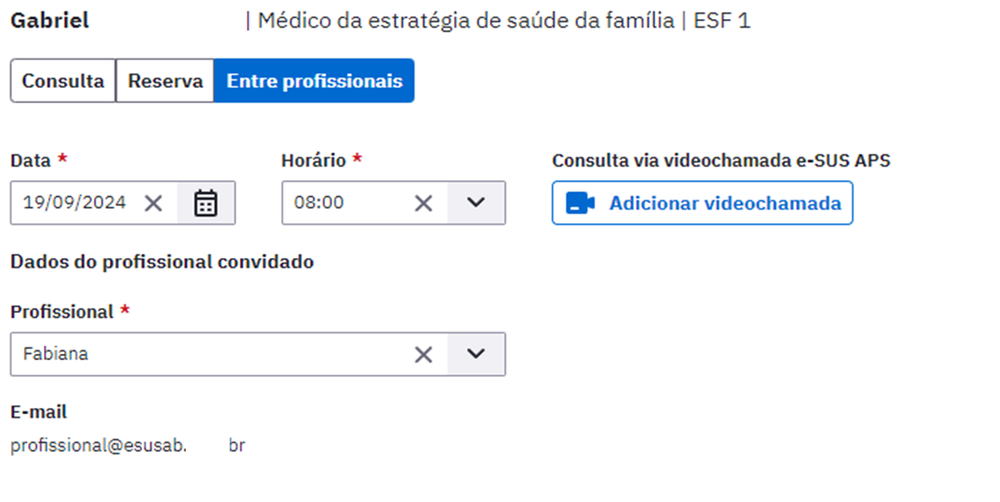

Ao entrar em agenda, selecionar o profissional e o horário desejado, poderá escolher entre consulta, reserva ou agendamento entre profissionais. 

Ao selecionar agendamento entre profissionais, deverá incluir o nome do profissional convidado, em seguida o nome do cidadão que será atendido e salvar.

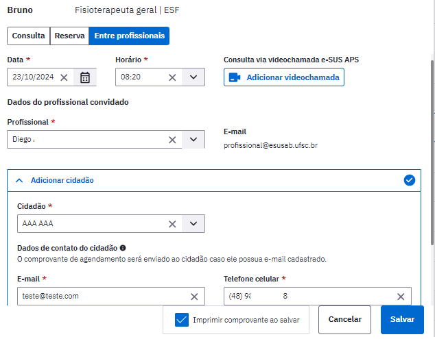

Na agenda do profissional, ficará registrado o nome do cidadão agendado e o profissional convidado, conforme imagem:

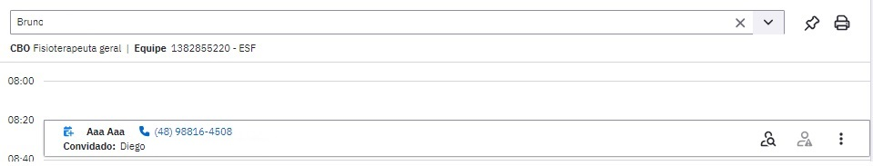

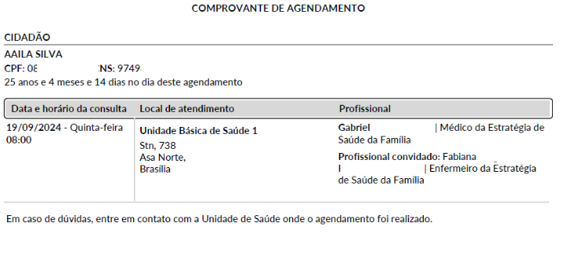

Para saber mais, consulte o Capítulo [PEC - Agenda](https://saps-ms.github.io/Manual-eSUS_APS/docs/PEC/PEC_05_agenda/#57-agendamento-entre-profissionais) 

**Acesso rápido na agenda**

Novo campo de pesquisa que possibilita acesso rápido na agenda profissional, como também fixação na lista em todos os campos do PEC e-SUS APS que se relacionam com a agenda. 

Esta funcionalidade, permite fixar os profissionais mais utilizados no topo da listagem, facilitando assim o agendamento.

Ao entrar no módulo "Agenda" será possível fixar um profissional para consulta rápida conforme imagem.

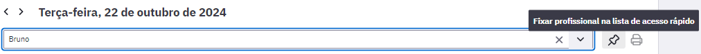

Nas próximas consultas, a agenda abrirá automaticamente no profissional fixado.

Ao ser informado o óbito de um cidadão, todos os agendamentos futuros deste cidadão serão cancelados e os profissionais responsáveis pelos agendamentos serão avisados por e-mail, caso o servidor SMTP esteja habilitado na instalação.

**Doses fracionadas por turno na prescrição de medicamento**

Novo campo na prescrição de medicamentos que possibilita tipo de dose fracionada por turno. 
O passo a passo está no capítulo PEC - Atendimento - Prescrição. 

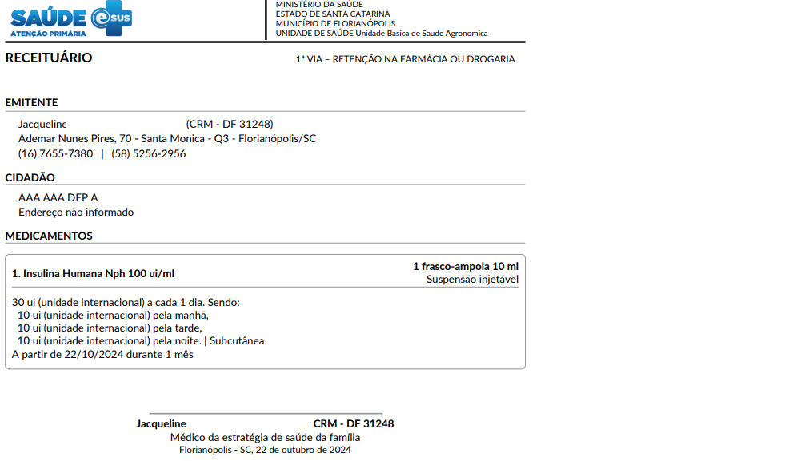

Para uma explicação mais detalhada consulte o Capítulo [Atendimento - Prescrição de medicamentos](https://saps-ms.github.io/Manual-eSUS_APS/docs/PEC/PEC_06_atendimentos/#64343-ferramentas-do-plano---prescri%C3%A7%C3%A3o-de-medicamentos)

**Atestado Digital**

Implementado campo para o envio do atestado digital para o cidadão. 

Ao selecionar "Gerar e enviar atestado digital", o profissional deverá incluir o e mail para envio do documento.

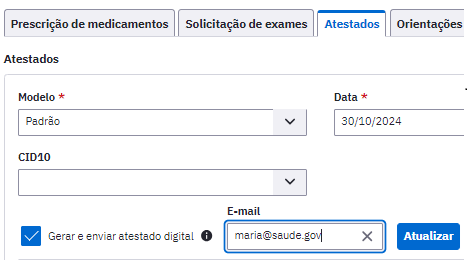

Em seguida, abrirá uma tela de aviso para conferência dos dados do atestado.

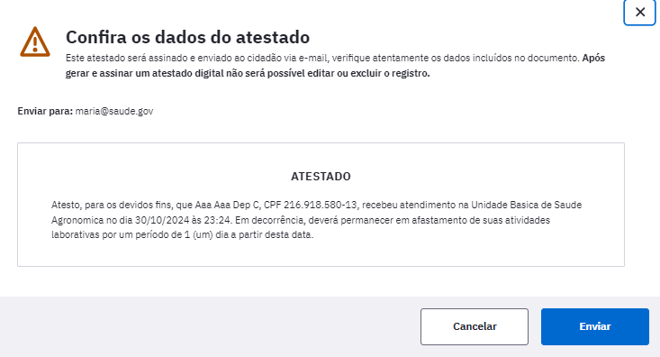

Na sequência, abrirá a tela de assinatura, sendo necessário que o profissional tenha assinatura cadastrada em um provedor.

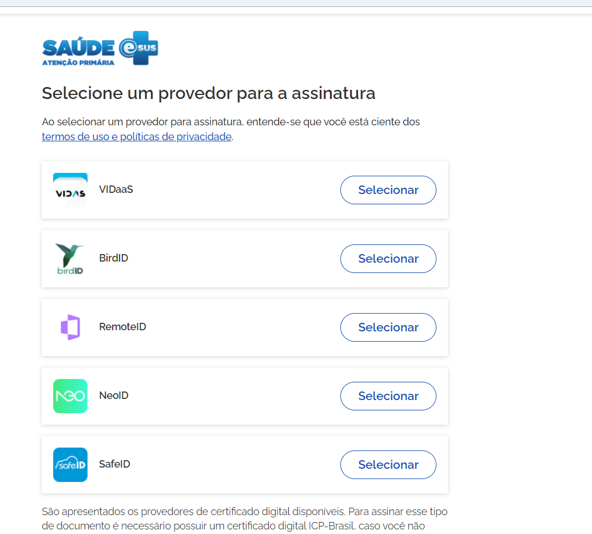

O registro do atestado digital ficará disponível no prontuário do cidadão.

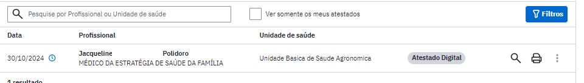

Atestado Digital com assinatura eletrônica

Consultar [Atendimentos - Atestado digital](https://saps-ms.github.io/Manual-eSUS_APS/docs/PEC/PEC_06_atendimentos/#atestado-digital)

**Acompanhamento de vulnerabilidade no prontuário**

O acompanhamento de vulnerabilidade foi criado no PEC para sinalizar quando o cidadão se enquadra em situações de insegurança alimentar. Esta classificação é resultado da resposta das duas perguntas da TRIA -  Triagem para Risco de Insegurança Alimentar, presentes da Ficha de Cadastro Individual do cidadão. 

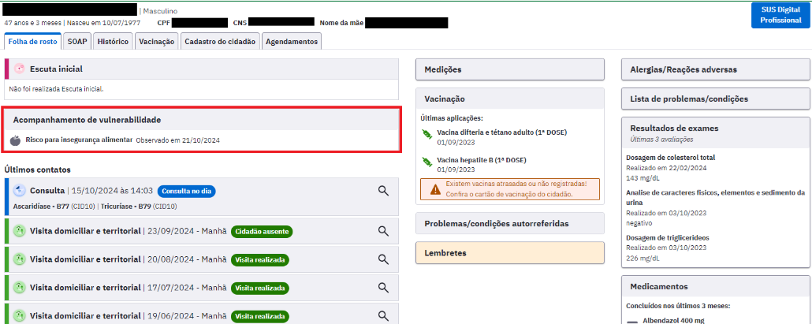

Quando há esta sinalização no prontuário do cidadão, é necessário que o profissional de saúde avalie todos os componentes do núcleo familiar, pois esta informação indica que há comprometimento da qualidade e quantidade da alimentação no domicílio e que o indivíduo se encontra em Risco para Insegurança Alimentar.

 É fundamental que se avalie também os Marcadores de Consumo Alimentar, para que possam tomar medidas de apoio e referência desses indivíduos à dispositivos da rede que garantam a Segurança Alimentar e Nutricional, bem como tudo que envolve essas questões no cidadão. 

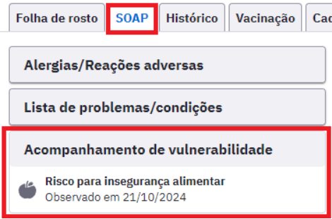

Para conhecer mais sobre esta funcionalidade e a TRIA, consulte o capítulo [Atendimento - Folha de Rosto](https://saps-ms.github.io/Manual-eSUS_APS/docs/PEC/PEC_06_atendimentos/#642-folha-de-rosto)
 
**Unificação de bases**

Esta ferramenta consolida as bases descentralizadas do PEC em uma estrutura única e centralizada. Esse avanço permite que todos os estabelecimentos de saúde integrem e implementem o conceito de Prontuário Eletrônico do Cidadão (PEC e-SUS APS) de forma unificada no âmbito municipal. 

Inclusão da funcionalidade “Unificação de Bases”, que permitirá aos municípios com várias instalações do PEC unificarem todos os seus bancos de dados em uma instalação única sem perda de nenhuma informação do prontuário eletrônico [Manual e-sus APS] (https://saps-ms.github.io/Manual-eSUS_APS/docs/PEC/PEC_03_adm_conf/)

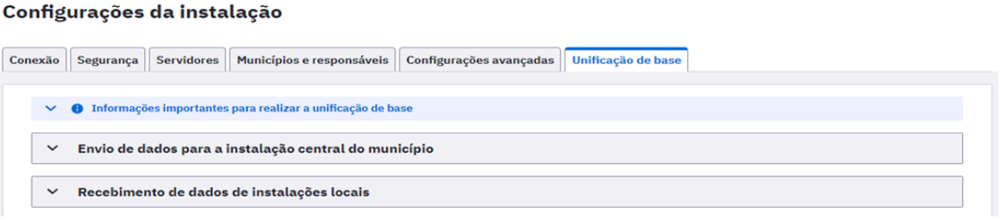

Para especificações desta funcionalidade, consultar o capítulo [Administração e Configurações do Sistema - Unificação de bases](https://saps-ms.github.io/Manual-eSUS_APS/docs/Apoio%20a%20Implanta%C3%A7%C3%A3o/Unificacao_de_bases/)

**Configuração HTTPS automatizada**

A geração e renovação do Certificado TLS (SSL) / HTTPS no PEC se tornou bem mais fácil, sendo agora gerenciado pela própria aplicação de maneira totalmente automatizada.  

Essa habilitação permite o uso de diversas funcionalidades que fortalecem o trabalho das equipes e o cuidado aos cidadãos, como teleinterconsultas, prescrição digital, acesso ao CadSUS. 

Para mais informações consulte: [LINK](https://saps-ms.github.io/Manual-eSUS_APS/docs/Apoio%20a%20Implanta%C3%A7%C3%A3o/HTTPS_Automatizado/)

**Histórico de acessos ao sistema** 

Possibilita ver o histórico de acessos ao sistema.

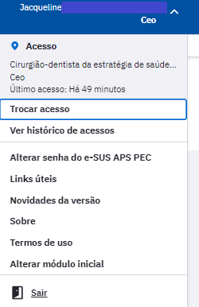

Este recurso fornece informações como a data e a hora dos acessos (bem ou malsucedidos) do login do profissional no e-SUS APS dos últimos 30 dias. 

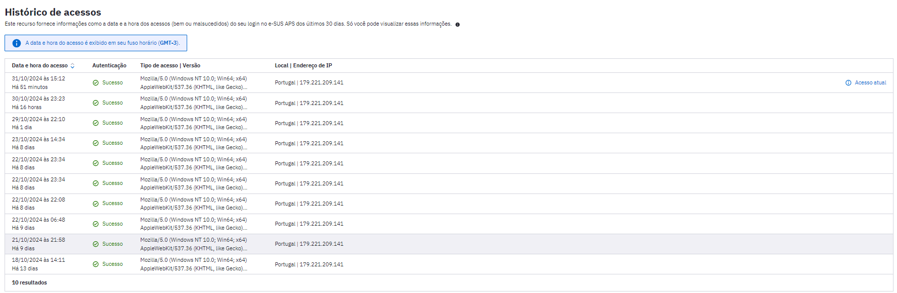

Somente o profissional que está logado pode visualizar essas informações.

**Atualização de terminologias dos envios à RNDS**

Na aba RNDS:  

Registro de Imunobiológicos Administrado em Campanha (RIA-C) ou Rotina (RIA-R) 

Registro de Atendimento Clínico (RAC) 

Registro de Prescrição de Medicamentos (RPM)

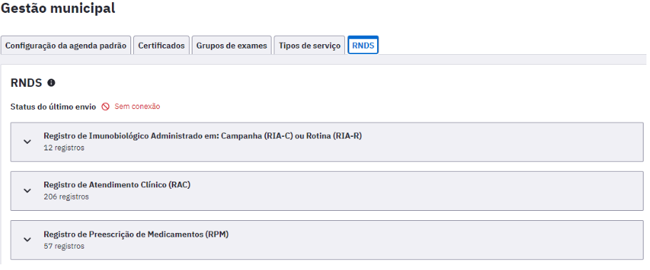

 **Relatório de erros retornados pela RNDS**

Nesta versão é possível gerar o relatório de erros de dados enviados à RNDS. 

Para gerar o relatório, o gestor municial deverá selecionar na aba lateral "Gestão Municipal".

Em seguida selecionar RNDS e selecionar "gerar relatório de erro".

Abrirá uma tela onde poderá selecionar o período desejado e gerar o relatório CSV.

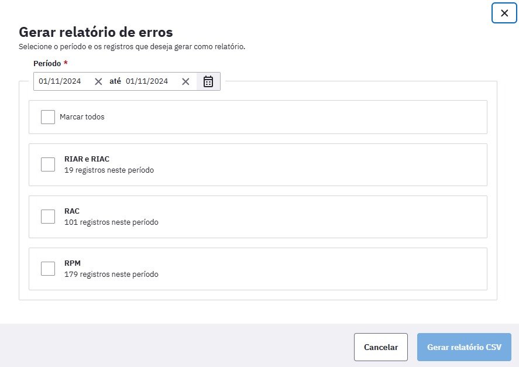

Deverá marcar todos ou os que desejar.

O relatório gerado, terá as informações: data de envio, tipo de registro, ID do registro, Status do envio, erro retornado pela RND.

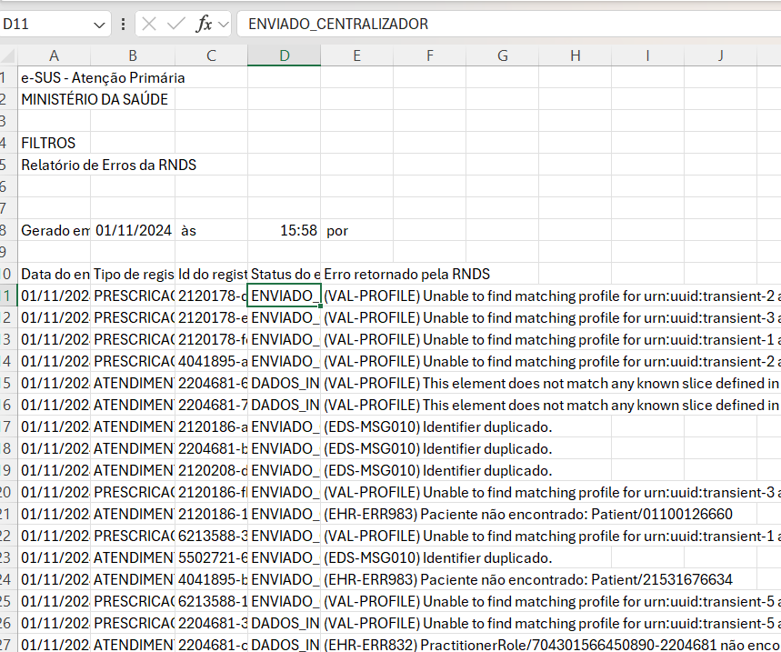

**Importar beneficiários do Bolsa Família**

Agora será possível importar um arquivo com os beneficiários do bolsa família de uma vigência específica para que eles sejam identificados em seus prontuários. 

O arquivo poderá ser baixado no e-Gestor e incluído para importação na funcionalidade de Importação do bolsa família, que pode ser acessada pelo menu lateral com o perfil de Instalador.  

É possível importar arquivos de qualquer vigência, inclusive listas complementares. 

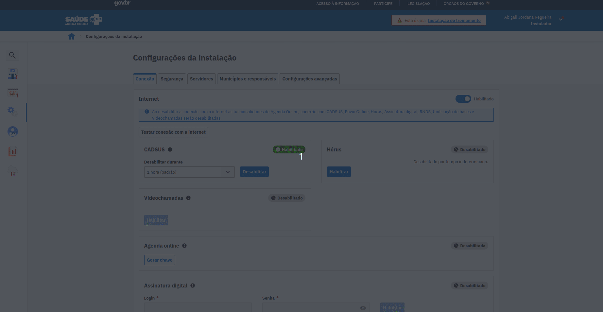

Ao visualizar a folha de rosto de um cidadão que consta como beneficiário no arquivo importado da vigência mais atual, será apresentada uma sinalização de que ele é beneficiário do Programa Bolsa Família. 

Para saber mais, acesse o [LINK](https://saps-ms.github.io/Manual-eSUS_APS/docs/PEC/PEC_02_instalacao/#27-importa%C3%A7%C3%A3o-do-bolsa-fam%C3%ADlia)

**Inclusão do nome social do profissional**

Agora, o PEC e-SUS APS amplia o uso do nome social não apenas para os cidadãos, mas também para os profissionais de saúde.  

Foi realizada a inclusão da possibilidade de se cadastrar um “nome social” para profissionais. Quando o nome social for registrado, o sistema passará a exibir somente o nome social nos módulos do sistema, com exceção do módulo administrativo e dos atendimentos antigos registrados quando o profissional só possuía nome civil. 

Conforme o Decreto nº8.727, de 28/04/2016, nome social se refere à designação pela qual a pessoa travesti ou transexual se identifica e é socialmente reconhecida. 

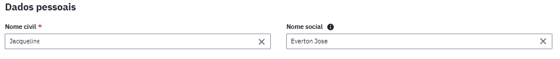

Essa implementação garante que o nome social do profissional seja exibido em todos os campos do sistema, incluindo impressões e prescrições eletrônicas. 

Receita realizada com nome social
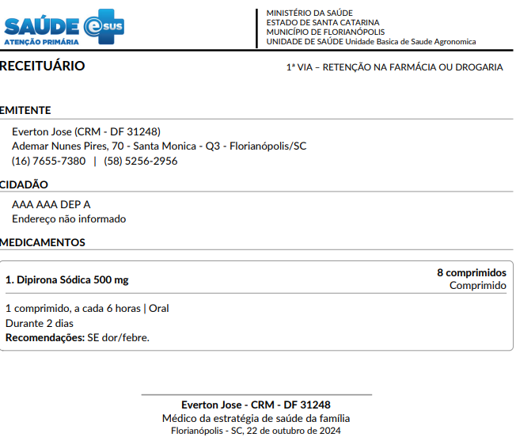

{: .nota }
Você conhece o [Educa e-SUS APS](https://educaesusaps.medicina.ufmg.br/)? É uma parceria do Ministério da Saúde e UFMG na oferta nacional de cursos gratuitos de educação permanente para a APS, contextualizada no sistema e-SUS APS. Aproveite e confira agora mesmo!

