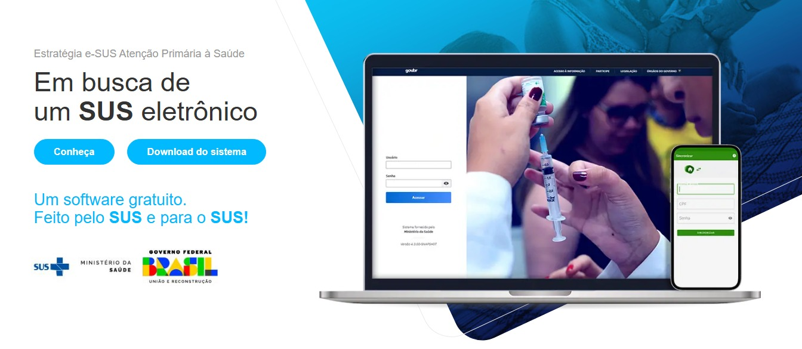

 
 
 
 
 
 

*Elaboração, distribuição e informações* 

**MINISTÉRIO DA SAÚDE** 
Secretaria de Atenção Primária à Saúde - SAPS 
Coordenação-geral de Inovação e Aceleração Digital - CGIAD 
Esplanada dos Ministérios - Bloco O - 7º andar 
CEP: 70.058-900 – Brasília/DF 
Site: <http://sisaps.saude.gov.br/esus/> 

**Ficha Catalográfica**

2024 Ministério da Saúde 
Esta obra é disponibilizada nos termos da Licença Creative Commons – Atribuição – Não Comercial – Compartilhamento pela mesma licença 4.0 Internacional. É permitida a reprodução parcial ou total desta obra, desde que citada a fonte. 

Tiragem: Edição revista e ampliada – 2024 – Versão eletrônica 

Elaboração, distribuição e informações: 

**Ministra de Estado de Saúde**

Nísia Trindade

**Supervisor Geral**

Felipe Proenço de Oliveira

**Coordenação Geral**

Rodrigo André Cuevas Gaete

**Organização**

Francy Webster de Andrade Pereira, Igor de Carvalho Gomes

**Elaboração de texto** 

Cinthia Caldas Rios, Jacqueline Aedinet Pruner Polidoro, Janaína Nogueira Guimarães, Jordana Soares Iankoski, Lilian Suelen de Oliveira Cunha, Nicoli Ferreira Demarche, Walter Augusto Alcantara Vieira, Willian Soares Lima 

**Revisão Textual** 

Adriana Kitajima, Adriene dos Santos Sá, Bruno Mariani, Cinthia Caldas Rios, Elaine de Almeida, Francy Webster de Andrade Pereira, Igor de Carvalho Gomes, Ingryd Isabelle Maia de Souza, Jacqueline Aedinet Pruner Polidoro, Janaína Nogueira Guimarães, Jordana Soares Iankoski, Lilian Suelen de Oliveira Cunha, Marcelo Alves Miranda, Nicoli Ferreira Demarche, Priscila Mara Anjos Nunes, Rodrigo André Cuevas Gaete, Romario Araujo Matias Rocha, Thaís Alessa Leite, Vanessa Lora, Vania Priamo, Walter Augusto Alcantara Vieira  

**Revisão Técnica**  

Jacqueline Aedinet Pruner Polidoro, Vania Priamo, Walter Augusto Alcantara Vieira

**Projeto Gráfico** 

Alexandre Soares de Brito, Diogo Ferreira Gonçalves 
 
 
 

**Uma versão revista, integrando as diversas funcionalidades em um arquivo só.** 

 
{: .nota }
Você conhece o [Educa e-SUS APS](https://educaesusaps.medicina.ufmg.br/)? É uma parceria do Ministério da Saúde e UFMG na oferta nacional de cursos gratuitos de educação permanente para a APS, contextualizada no sistema e-SUS APS. Aproveite e confira agora mesmo!

