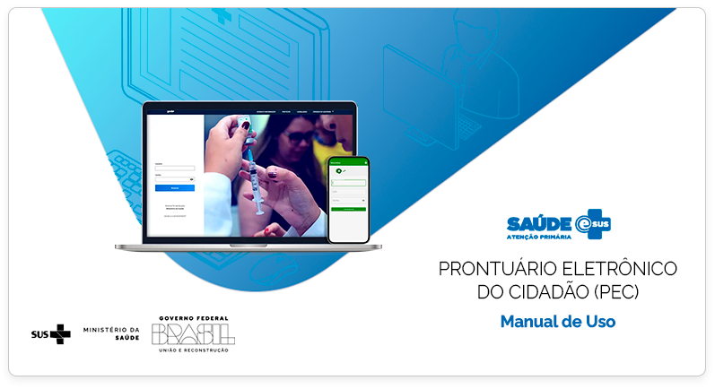

 
 
 
 
 
 

*Elaboração, distribuição e informações* 

**MINISTÉRIO DA SAÚDE** 
Secretaria de Atenção Primária à Saúde 
Departamento de Saúde da Família 
Esplanada dos Ministérios - Bloco G - 7º andar 
CEP: 70.058-900 – Brasília/DF 
Tels.: (61) 3315-8090 / 3315-8044 
Site: <http://sisaps.saude.gov.br/esus/> 

**Supervisor Geral** 
Felipe Proenço de Oliveira

**Coordenação Técnica Geral** 
Rodrigo André Cuevas Gaete

**Organização** 
Adriene dos Santos Sá, Igor de Carvalho Gomes, Jacqueline Aedinet Pruner Polidoro, Janaína Nogueira Guimarães, Romario Araujo Matias Rocha, Willian Soares Lima, .

**Revisão Técnica** 
Adriene dos Santos Sá, Elaine de Almeida, Igor de Carvalho Gomes, Ingryd Isabelle Maia de Souza, Jacqueline Aedinet Pruner Polidoro, Janaína Nogueira Guimarães, Marcelo Alves Miranda, Romario Araujo Matias Rocha, Viviane Loiola Lacerda, Willian Soares Lima, Walter Augusto Alcantara Vieira.

**Colaboradores** 
Adriene dos Santos Sá, Adriana Kitajima, Adriene dos Santos Sá, Allan Nuno Alves de Souza, Ana Claudia Cielo, André Cury Alves, Edson Lucena, Elaine de Almeida, Graziela Ribeiro Fonseca,  Igor de Carvalho Gomes, Ingryd Isabelle Maia de Souza, João Geraldo de Oliveira Júnior, Jacqueline Aedinet Pruner Polidoro, Janaína Nogueira Guimarães, Lilian Suelen de Oliveira Cunha, Marcelo Alves Miranda, Micael Macedo Pereira da Trindade, Nicoli Ferreira Demarche, Patrícia Rocha Vedova Pirola, Rodrigo André Cuevas Gaete, Romario Araujo Matias Rocha, Thaís Alessa Leite, Vanessa Lora, Virgínia Fava, Viviane Loiola Lacerda, Walter Augusto Alcantara Vieira, Webster Pereira, Willian Soares Lima.

**Projeto Gráfico** 
Alexandre Soares de Brito, Diogo Ferreira Gonçalves
 
 
 

**Ficha Catalográfica**
{: .text-center }

Brasil. Ministério da Saúde. Secretaria de Atenção Primária à Saúde. 
e-SUS Atenção Primária à Saúde: Manual do Sistema com Prontuário Eletrônico do Cidadão PEC – Versão 5.2 [recurso eletrônico] / Ministério da Saúde, Secretaria de Atenção Primária à Saúde, Secretaria Executiva. – Brasília: Ministério da Saúde, 2023. 
 
ISBN **Versão Preliminar** 
Modo de acesso: <https://aps.saude.gov.br/ape/esus> 
CDU 614 

Catalogação na fonte – Coordenação-Geral de Documentação e Informação – Editora MS – OS 2023.
